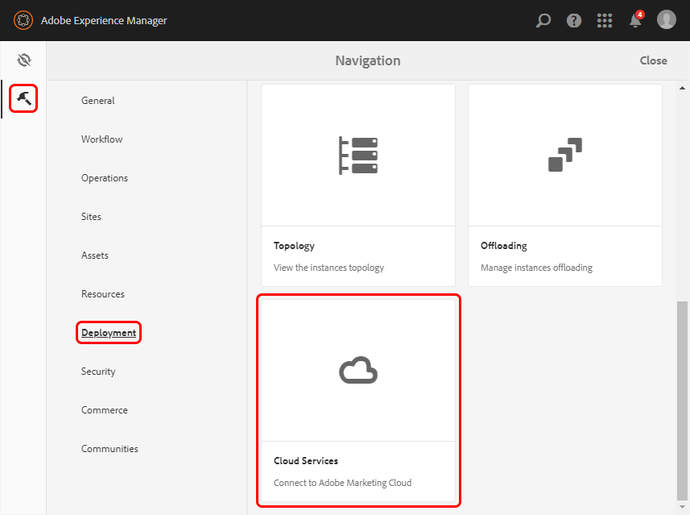
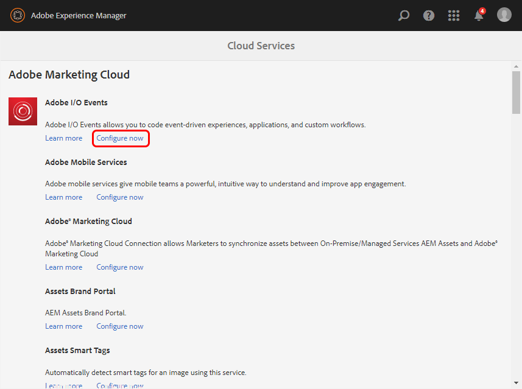
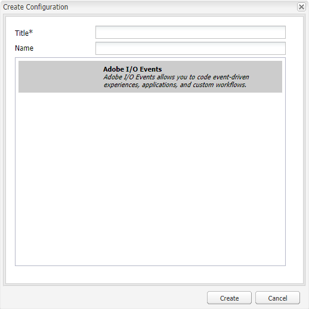
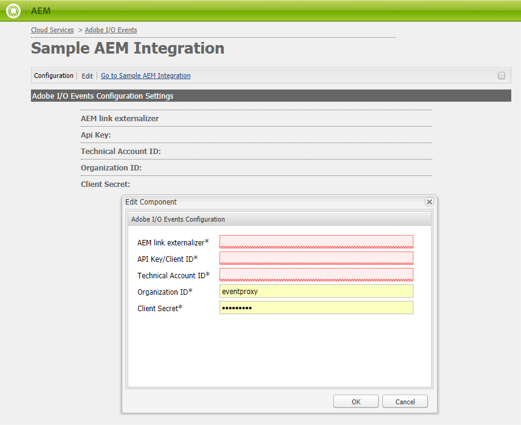

### AEM (6.3.x and prior) `Cloud Services` configuration

To secure the calls between Adobe I/O and AEM, we leverage an oAuth JWT exchange token flow.
 This flow uses a certificate to sign the JWT request and therefore requires certificates configurations on both ends.
 
Here are the final steps describing the `Cloud Services configuration needed by Adobe I/O Events to perform this oAuth JWT exchange token flow
(for AEM version 6.3.x and before).

The prerequisites are
* [a keystore added into AEM service user&rsquo;s keystores vault](aem_keystore_setup.md)  
* [an developer console project created using the associated public certificate](aem_console_setup.md)

Once the above is complete, to configure Adobe I/O Events `Cloud Services in AEM:

1. Open the Cloud Services console, or select the **Tools** icon, then select **Deployment** and **Cloud Services**.

      

2. Under **Adobe Marketing Cloud** on the **Cloud Services** page, select **Configure now** for **Adobe I/O Events**.

      

3. In the Create Configuration dialog box, enter a title and a name for your integration, and then select Create.
      

4. Select Edit. Configure the service by specifying each field in the **Edit Component** dialog box. You can copy your credentials from the [Adobe I/O developer Console](https://adobe.io/console) and paste them into each required field.

      

*   For **AEM Link externalizer**: specify **author** (or any other alias previously configured in the AEM Link Externalizer).
*   For **API key**: Provide the key shown on the **Integration Details** page of the Adobe I/O developer Console.
*   For **Technical Account ID**: Provide the ID shown on the Adobe I/O developer Console.
*   For **Organization ID**: Provide the ID shown on the Adobe I/O developer Console.
*   For **Client Secret**: AEM will automatically retrieve the value from the Adobe I/O developer Console.

