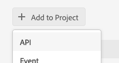

### Create an Adobe I/O Console AEM integration workspace

For your AEM to be authorized to emit events against Adobe I/O:
you do need to add the  API in your Adobe I/O Console project set up in the console (if you are new to this please 
refer to the [step-by-step instructions for creating an empty project in Adobe Developer Console](https://www.adobe.io/apis/experienceplatform/console/docs.html#!AdobeDocs/adobeio-console/master/projects-empty.md) )

1. Click on `Add to Project` > `API`

   

2. Select `I/O Events API`, Click `Next`

   

3. In the next `Create a new service account (JWT) credential` screen, choose `Option 2` 
and upload your public certificate, the very same one you put in the AEM service user's keystore,
see our [AEM keystore setup documentation](aem_keystore_setup.md).

6. Click on `Save configured API`

   

7. Done ! You should now see `I/O Events` in your API list:

   
 
Note you also have a new JWT integration tab, that you will come back to in order to finalize the configuration
of your AEM instances.
You may also refer to the overal [Adobe I/O console documentation](https://www.adobe.io/apis/experienceplatform/console/docs.html#!AdobeDocs/adobeio-console/master/services-add-api-jwt.md) 
for more details on this.