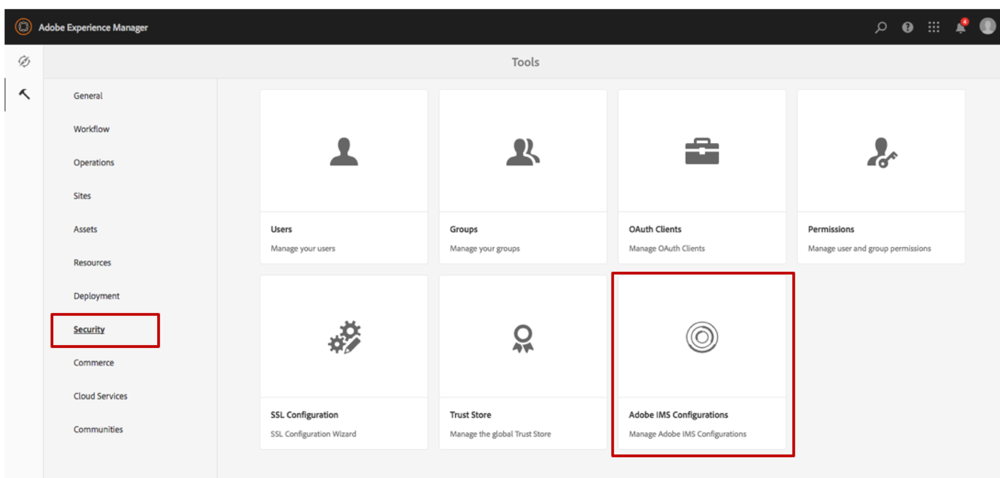
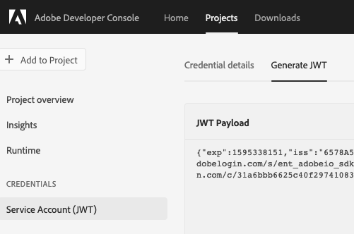
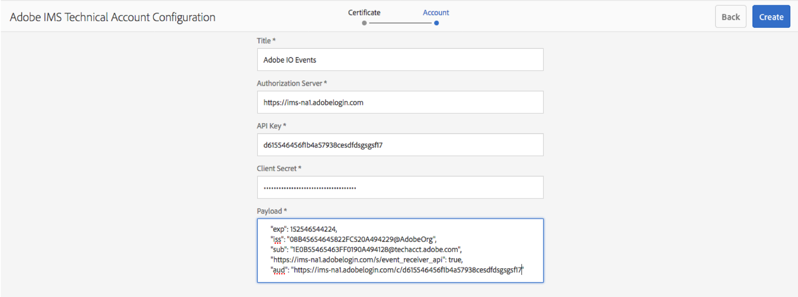

### Adobe IMS configuration

To secure the calls between Adobe I/O and AEM, we leverage an oAuth JWT exchange token flow.
 This flow uses a certificate to sign the JWT request and therefore requires certificates configurations on both ends.
 
Here are the final steps describing the Adobe IMS configuration needed by Adobe I/O Events to perform this oAuth JWT exchange token flow.

The prerequisites are
* [a keystore added into AEM service user&rsquo;s keystores vault](aem_keystore_setup.md)  
* [an developer console project created using the associated public certificate](aem_console_setup.md)

Once the above is complete:

1. Open your AEM `Tools` menu, or select the `Security` section, and then select `Adobe IMS Configurations` tile.

   

2. Click **Create**; 
**Select `AdobeIOEvents`** in the Cloud Solution drop down; once selected, you should see the certificate you just added to the AEM `eventproxy-service` user's keystore;
   Click **Next**

    

3. Fill in the various entries expected to configure the IMS account associated with the integration
 you just [created in the Adobe I/O developer Console](aem_console_setup.md):
     * For **Title**: specify **Adobe IO Events** (or any other title that makes sense to you).
     * For **Authorization Server**: it should be `https://ims-na1.adobelogin.com` (unless the URL shown in the **JWT** tab of your integration page in the Adobe I/O developer Console is different),
     * For **API key**: Provide the `CLIENT ID` available in the `Credentials details` tab of your credentials `Service Account (JWT)` page in your Adobe I/O developer Console workspace
     * For **Client Secret**: Provide the `CLIENT SECRET` available in the `Credentials details` tab of your credentials `Service Account (JWT)` page in your Adobe I/O developer Console workspace
     * For **Payload**: Provide the `JWT payload` available in the `Generate JWT` tab of your credentials `Service Account (JWT)` page in your Adobe I/O developer Console workspace
  
   

4. Click **Create**

    

5. Now you should see this new Adobe I/O Events IMS Configuration, and you can select it to check its health.

     
      

