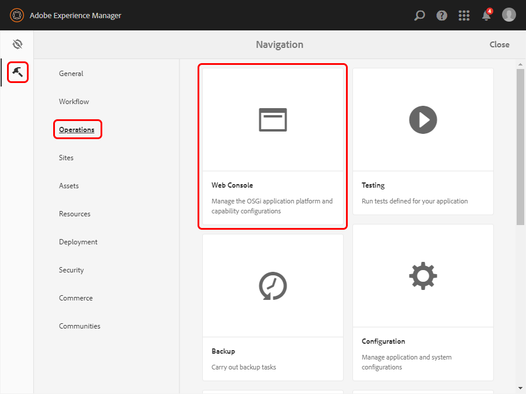
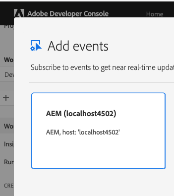

### `AEM Link Externalizer` Configuration

The AEM Link Externalizer `author` value is used by default by Adobe I/O Events 
as a unique identifier of the AEM author host withing an IMS organization.

To configure AEM Link Externalizer:

* Open the Web Console, or select the **Tools** icon, then select **Operations** and **Web Console**.

    The AEM Link Externalizer name can be **author** or any other alias specified in the Adobe Experience Manager Web Console.

    

* Scroll down the list to find **Day CQ Link Externalizer**, update the domain name, and select **Save** when done.

Note that the base URL that you specify appears there will be reflected 
in the Adobe developer console in the AEM event provider label. 
If you keep it default, that is `http://localhost:4502`, 
here is how it will be shown the Adobe developer console:

    

