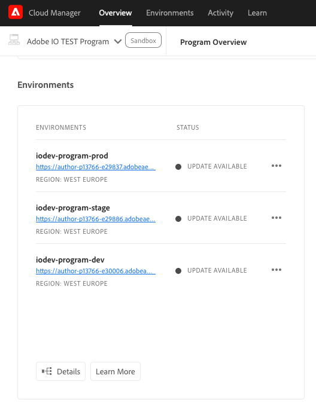
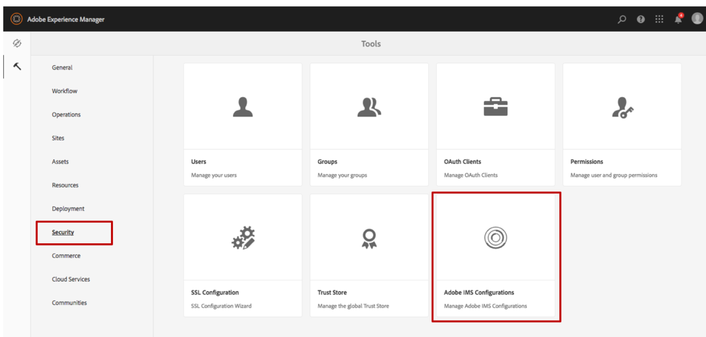
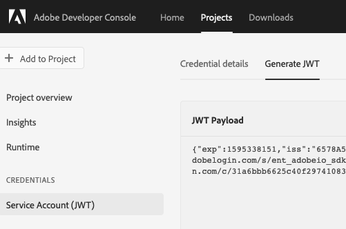
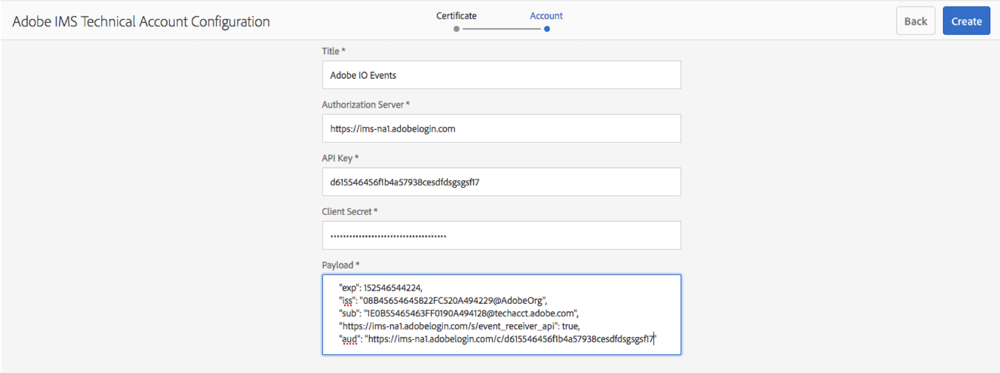
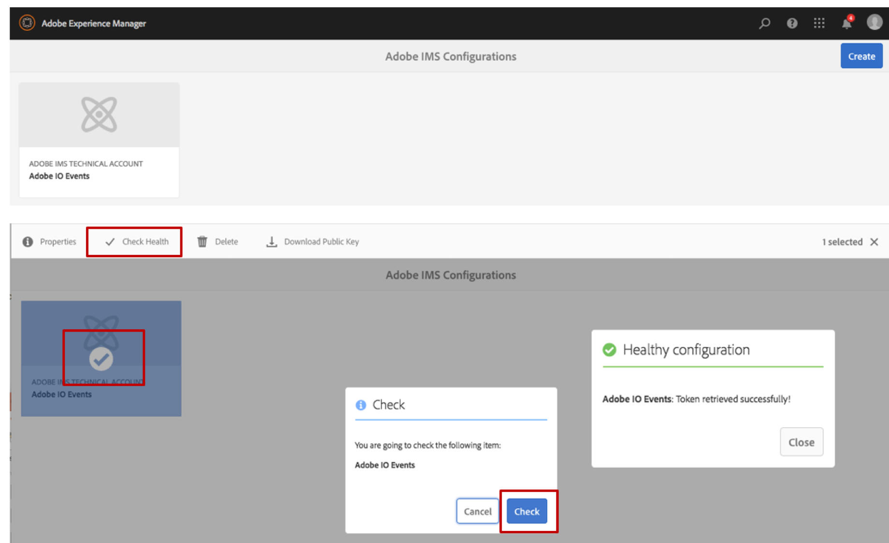
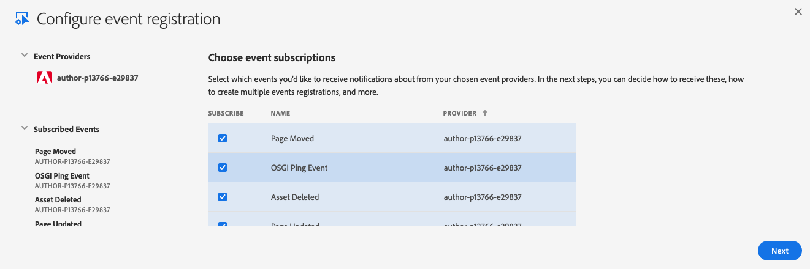
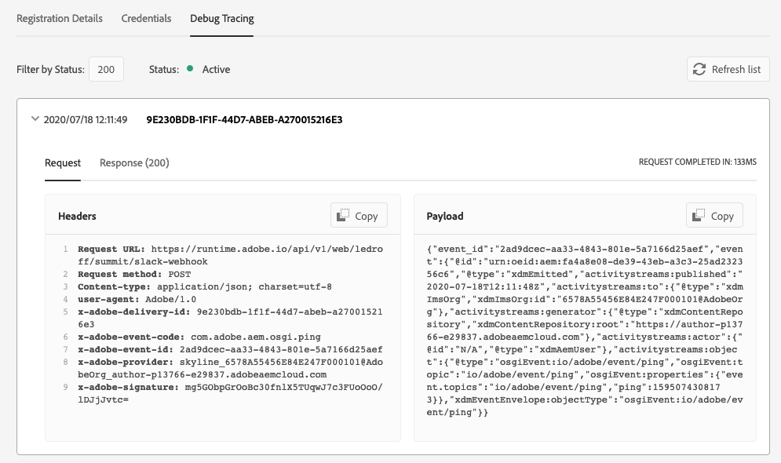
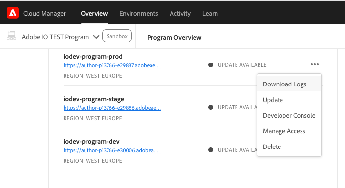

## Integrate with AEM as a Cloud Service

This documentation has instructions to set up I/O Events integrations with `AEM as a Cloud Service` set up.

To integrate with `AEM on premise`, please refer to the other associated [documentation](aem_on_premise_install.md).

### Pre-release provisioning

If you are an existing `AEM as a Cloud Service` customer, please contact your Adobe representative and provide them with the following information: 
* Adobe IMS Organization Id of the org being used (the id suffixed by `@AdobeOrg` you can find in the `Service Account (JWT)` section of your  [Adobe I/O Developer console](aem_console_setup.md) project),
* List of public urls of the Author instance of the `AEM as a Cloud Service` which will be exposed to Adobe I/O as `Events Providers`. 

For the latter, log in to [your cloud manager](my.cloudmanager.adobe.com/) and look up the `AEM as a Cloud Service` environments. From there, copy the URLs of the author environments which will be exposing events to Adobe I/O and will be the Adobe I/O `Events Providers`. 

  

Once the provisioning request is processed and completed, the new `AEM as a Cloud Service` `Events Providers` should appear in the Adobe I/O console. Please refer to the Developer Console documentation on how to [add Events to a project](https://www.adobe.io/apis/experienceplatform/console/docs.html#!AdobeDocs/adobeio-console/master/services-add-event.md) 
if you are new to this.
 
  
 
You are now ready to set up your `AEM as a Cloud Service` environments as an Event provider, which means your `AEM as a Cloud Service` instance will be emitting events. 

Follow the instructions below to complete the setup: 

### Deploy Adobe I/O Events integration using Cloud Manager

The Adobe I/O Events integration is currently being exposed through an integration package which requires you to follow the below deployment instructions. This configuration will change in future once Adobe I/O Events is exposed as a configuration in `AEM as a Cloud Service`. 

1. [Download the code](https://github.com/AdobeDocs/adobeio-events/releases/tag/2020_07_20_13_00),
2. Unzip this archive, and merge it with your own existing Cloud Manager git repo, see [Experience Manager Cloud Manager - Help - Accessing Git ](https://docs.adobe.com/content/help/en/experience-manager-cloud-manager/using/managing-code/accessing-git.html) for further instructions
3. [Deploy it](https://docs.adobe.com/content/help/en/experience-manager-cloud-manager/using/how-to-use/deploying-code.html) 

### Configure Adobe I/O authentication

To secure the calls between Adobe I/O and AEM, we leverage an oAuth JWT exchange token flow. This flow uses a certificate to sign the JWT request and therefore requires certificates configurations on both ends. Please look at our documentation:
* As a first step, [set up a keystore on AEM](aem_keystore_setup.md) 
* Once the keystore setup is complete, [set up an AEM workspace in Adobe I/O developer console](aem_console_setup.md)

Once you finish configuring the Adobe I/O authentication steps, you will have the following:

* A public/private certificate key and an associated keystore
* The keystore added into the AEM `eventproxy-service` user&rsquo;s keystores vault
* An Adobe I/O Console project and workspace is created using the public certificate

To execute the final steps for the Adobe IMS configuration needed by Adobe I/O Events, follow instructions below:

1. Open your AEM `Tools` menu, or select the `Security` section, and then select `Adobe IMS Configurations` tile.

   

2. Click **Create**; 
**Select `AdobeIOEvents`** in the Cloud Solution drop down; once selected, you should see the certificate you just added to the AEM `eventproxy-service` user's keystore;
   Click **Next**

    

3. Fill in the various entries expected to configure the IMS account associated with the integration
 you just [created in the Adobe I/O Console](aem_console_setup.md):
     * For **Title**: specify **Adobe IO Events** (or any other title that makes sense to you).
     * For **Authorization Server**: it should be `https://ims-na1.adobelogin.com` (unless the URL shown in the **JWT** tab of your integration page in the Adobe I/O Console is different),
     * For **API key**: Provide the API key available in the `Credentials details` tab of your credentials `Service Account (JWT)` page in your Adobe I/O Console workspace
     * For **Client Secret**: Provide the Client Secret available in the `Credentials details` tab of your credentials `Service Account (JWT)` page in your Adobe I/O Console workspace
     * For **Payload**: Provide the JWT payload available in the `Generate JWT` tab of your credentials `Service Account (JWT)` page in your Adobe I/O Console workspace
  
   

4. Click **Create**

    

5. Now you should see this new Adobe I/O Events IMS Configuration, and you can select it to check its health.

     
      

### Ping Events 

Now you can start verifying that your `AEM as a Cloud Service` environment is emitting events to Adobe I/O.
To do that register a new [webhook](../intro/webhook_docs_intro.md) or start pulling events from this new source using the [journaling API](../intro/journaling_api.md).

Make sure you register to receive `OSGI Ping Event`

   
 
If your webhook registration is active, every minute or so, you should see ping events showing up in the debug tracing tab:

   

If not, [have a look at your logs](https://docs.adobe.com/content/help/en/experience-manager-learn/cloud-service/debugging/debugging-aem-as-a-cloud-service/logs.html), and look for `com.day.cq.dam.eventproxy` in the error logs to better identify the issue.

  

You can also use the [developer console](https://docs.adobe.com/content/help/en/experience-manager-learn/cloud-service/debugging/debugging-aem-as-a-cloud-service/developer-console.html) to verify the state of the `aem-event-proxy` bundle.
