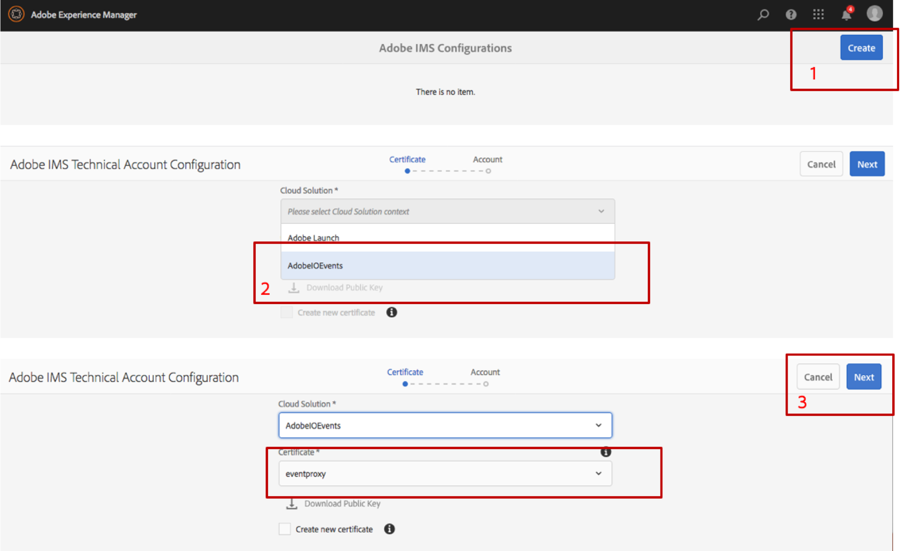

## Integrate with AEM as a Cloud Service

This documentation is specific to `AEM as a Cloud Service` set up, to integrate with `AEM on premise` 
please refer to the other associated [documentation](aem_on_premise_install.md).

### Pre-release provisioning

If you are an existing `AEM as a Cloud Service` customer, please contact your Adobe representative providing your AEM authors public urls.

For that, log-in to [your cloud manager](my.cloudmanager.adobe.com/) space, look up your authors environments

  

Select from this list the environments public url you want Adobe I/O to expose as `Events Providers` . 

As soon as the Adobe I/O team is done provisioning it, your new `AEM as a Cloud Service` `Events Providers` should appear in the Adobe I/O console.
 
  
 
You are now ready to set up your `AEM as a Cloud Service` environments for them to start emitting events, see below.

### Deploy Adobe I/O events integration using Cloud Manager

As this Adobe I/O events integration is not yet part of the core product, you will have to

1. [Download the code from this repository](https://github.com/AdobeDocs/adobeio-events/releases/download/2020_07_20_13_00/aem-event-proxy-skyline-2020_07_20_13_00.zip),
2. Uncompress this archive, and merge it with your own existing Cloud Manager git repo,
see [Experience Manager Cloud Manager - Help - Accessing Git ](https://docs.adobe.com/content/help/en/experience-manager-cloud-manager/using/managing-code/accessing-git.html) 
for further instructions,
3. [Deploy it](https://docs.adobe.com/content/help/en/experience-manager-cloud-manager/using/how-to-use/deploying-code.html) 

### Configure Adobe I/O authentication

To secure the calls between Adobe I/O and AEM, we leverage an oAuth JWT exchange token flow.
This flow uses a certificate to sign the JWT request and therefore requires certificates configurations
on both ends. Please look at our documentations:
* first [set up a keystore on AEM](aem_keystore_setup.md) 
* then [set up an AEM workspace in Adobe I/O console](aem_console_setup.md)

Once these 2 setups are done, you should have:

* created a public/private certificate key and an associated keystore
* added the keystore into the AEM `eventproxy-service` user&rsquo;s keystores vault.
* created an Adobe I/O Console project and workspace using the public certificate

You are now ready to finalize the Adobe IMS configuration needed by Adobe I/O Events:

1. Open the Cloud Services console, or select the **Security** icon, and then select **Adobe IMS Configurations**.

   

2. Click **Create**;
   **Select `AdobeIOEvents`** in the Cloud Solution drop down; once selected, you should see the certificate you just added to the AEM `eventproxy-service` user's keystore;
   Click **Next**

    

3. Fill in the various entries expected to configure the IMS account associated with the integration
 you just [created in the Adobe I/O Console](aem_console_setup.md):
     * For **Title**: specify **Adobe IO Events** (or any other title that makes sense to you).
     * For **Authorization Server**: it should be `https://ims-na1.adobelogin.com` (unless the URL shown in the **JWT** tab of your integration page in the Adobe I/O Console is different),
     * For **API key**: Provide the API key available in the `Credentials details` tab of your credentials `Service Account (JWT)` page in your Adobe I/O Console workspace
     * For **Client Secret**: Provide the Client Secret available in the `Credentials details` tab of your credentials `Service Account (JWT)` page in your Adobe I/O Console workspace
     * For **Payload**: Provide the JWT payload available in the `Generate JWT` tab of your credentials `Service Account (JWT)` page in your Adobe I/O Console workspace
  
   

4. Click **Create**

    

5. Now you should see this new Adobe IO Events IMS Configuration, and you can select it to check its health.

     
      

### Ping Events 

Now you can start verifying that your `AEM as a Cloud Service` environment is emitting events to Adobe I/O.
To do that register a new [webhook](../intro/webhook_docs_intro.md) or start pulling events from this new source using the [journaling API](../intro/journaling_api.md).

Make sure you register to receive `OSGI Ping Event`

   
 
If your webhook regitration is active, every minutes or so, 
you should see ping events showing up in the debug tracing tab:

   

If not, [have a look at your logs](https://docs.adobe.com/content/help/en/experience-manager-learn/cloud-service/debugging/debugging-aem-as-a-cloud-service/logs.html), and look for `com.day.cq.dam.eventproxy` in the error logs to better identify the issue.

  

You can also use the [developer console](https://docs.adobe.com/content/help/en/experience-manager-learn/cloud-service/debugging/debugging-aem-as-a-cloud-service/developer-console.html)
to verify the state of the `aem-event-proxy` bundle.