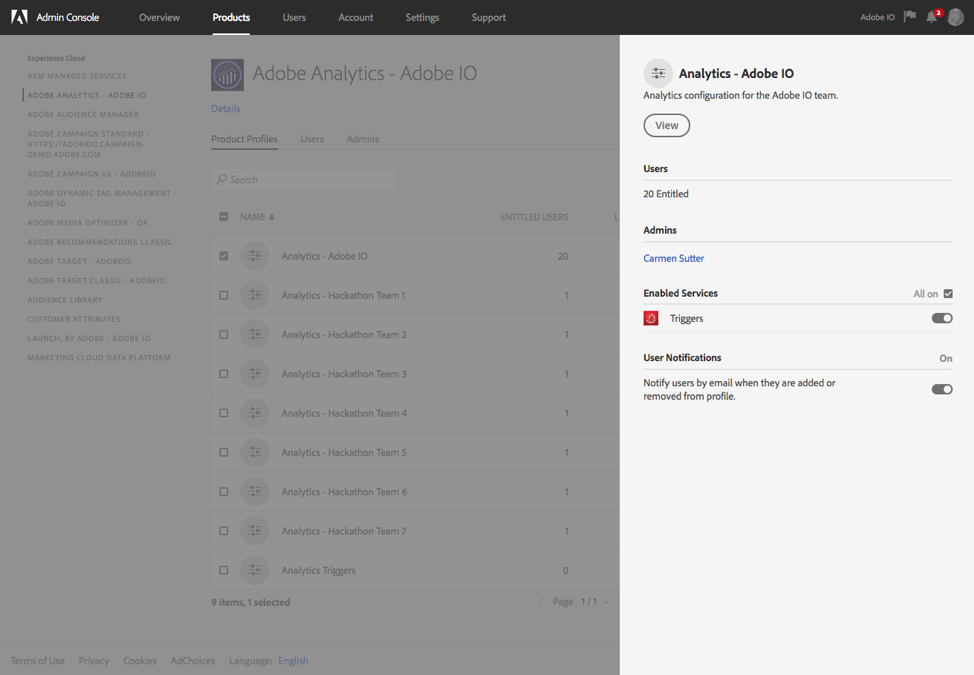

<!--:navorder: 3-->

# Adobe I/O Events Frequently Asked Questions (FAQ)

* [General questions](#general-questions)
* [Analytics Triggers Events](#analytics-triggers-events)

## General questions

_**What are I/O Events?**_  

I/O Events make meaningful Adobe Cloud Platform events available to 1st and 3rd party developers.

_**Which events are currently supported via I/O?**_  

Currently, following Adobe solutions are supported via I/O Events:

* Adobe Experience Manager Page, Asset, & Custom Events (create, update, delete)
* Adobe Analytics Triggers
* Creative Cloud Asset Events (create, update, delete)

_**What permissions are required to use I/O Events?**_  

To access the Adobe I/O Console and create or manage integrations for AEM and Analytics Triggers, a user must have Enterprise Administrator permissions.

_**Which subscription types do I/O Events support?**_  

I/O Events support webhooks for near-real time notifications (push) as well as a Journaling API (pull) to grab groups of events at a time.

_**How far back are I/O Events available via the Journaling API?**_  

Adobe I/O stores 7 days of subscribed events that can be retrieved via the Journaling API.

_**What happens if a webhook is down?**_  

I/O Events will retry up to five times. A webhook is considered inactive after five unsuccessful retries with either no response or a response other than HTTP 2XX. The Journaling API can be used to retrieve events that were published while the webhook is down.

_**Are there other ways to access I/O Events?**_  

Yes: 
- [Azuqua](https://www.azuqua.com) provides connectors for both AEM events and Analytics Triggers events.
- [Microsoft Flow](https://flow.microsoft.com) has a connector for Creative Cloud Asset events.

_**What is JWT and what is it used for?**_  

JSON Web Token (JWT) is an open standard (RFC 7519) that defines a compact and self-contained way for securely transmitting information between parties as a JSON object. For more information on JSON Web Tokens, see [Introduction to JSON Web Tokens](https://jwt.io/introduction/) on JWT.io.

To use Adobe I/O Events, you&rsquo;ll need a set of client credentials to authenticate the identity of the caller and authorize access. The type of application you are building determines the type of integration that provides the client credentials you will need.

A Service Account integration allows your application to call Adobe services on behalf of the application itself, or on behalf of an enterprise organization.

For this type of integration, you&rsquo;ll need to create a JSON Web Token (JWT) that encapsulates your credentials and begin each API session by exchanging the JWT for an access token. The JWT encodes all of the identity and security information required to obtain an access token,  and must be signed with the private key that is associated with a public key certificate specified on your integration.

_**Where can I find documentation on JSON Web Token (JWT) Service accounts and how to set them up?**_  

See the Authentication Guide: [Creating a JSON Web Token](https://www.adobe.io/apis/cloudplatform/console/authentication/createjwt.html).

_**Do you have sample libraries for JWT?**_  

Yes:
- Python: https://pyjwt.readthedocs.io/en/latest/
- .Net: https://github.com/jwt-dotnet/jwt
- Java: https://github.com/jwtk/jjwt
- Objective C: https://github.com/yourkarma/JWT
- Node.js: https://github.com/auth0/node-jsonwebtoken
- Node.js: https://www.npmjs.com/package/jsonwebtoken
- Node.js: https://www.npmjs.com/package/jwt-simple
- JavaScript tutorial: - https://www.jonathan-petitcolas.com/2014/11/27/creating-json-web-token-in-javascript.html
- Javascript: http://kjur.github.io/jsrsasign/

## Analytics Triggers Events

**Where can I find instructions on setting up Analytics Triggers for I/O?**  

You'll find it in this guide at [Integrate Analytics Triggers with Adobe I/O Events](../using/analytics-triggers-event-setup.md). 

**Where do I configure Analytics Triggers for I/O?**  

Analytics Triggers are set up and managed via the Experience Cloud Activation UI. Once a Trigger has been created, it will appear in Adobe I/O Console under the available I/O Events list.

**What does an Analytics Triggers payload look like?**  

Here is a sample:

```json
{
  "event_id": "52ebf673-8aeb-4347-8852-bf86a18292e4",
  "event": {
    "envelopeType": "DATA",
    "partition": 13,
    "offset": 438465548,
    "createTime": 1516324157242,
    "topic": "triggers",
    "com.adobe.mcloud.pipeline.pipelineMessage": {
      "header": {
        "messageType": "TRIGGER",
        "source": "triggers",
        "sentTime": 1516324157228,
        "imsOrg": "C74F69D7594880280A495D09@AdobeOrg",
        "properties": [
          {
            "name": "trace",
            "value": "false"
          },
          {
            "name": "sourceFirstTimestamp",
            "value": "1516324106"
          },
          {
            "name": "sourceLastTimestamp",
            "value": "1516324128"
          },
          {
            "name": "triggerFiredTimestamp",
            "value": "1516324153995"
          }
        ],
        "messageId": "1a69fc40-7600-4928-b7bb-d66588a045f3"
      },
      "com.adobe.mcloud.protocol.trigger": {
        "triggerId": "697514a8-3337-4efc-ba75-1f0ba896c288",
        "triggerTimestamp": 1516324157228,
        "mcId": "00000000000000000000000000000000000000",
        "enrichments": {
          "analyticsHitSummary": {
            "dimensions": {
              "eVar3": {
                "type": "string",
                "data": [
                  "localhost:4502/content/we-retail.html",
                  "localhost:4502/content/we-retail/us/en/men.html",
                  "localhost:4502/content/we-retail.html",
                  "localhost:4502/content/we-retail/us/en.html",
                  "localhost:4502/content/we-retail/us/en.html",
                  "localhost:4502/content/we-retail/us/en/products/men/shirts/eton-short-sleeve-shirt.html",
                  "localhost:4502/content/we-retail/us/en/products/men/shirts/eton-short-sleeve-shirt.html",
                  "localhost:4502/content/we-retail/us/en/men.html",
                  "localhost:4502/content/we-retail/us/en/user/cart.html"
                ],
                "name": "eVar3",
                "source": "session summary"
              },
              "pageURL": {
                "type": "string",
                "data": [
                  "http://localhost:4502/content/we-retail.html",
                  "",
                  "",
                  "http://localhost:4502/content/we-retail/us/en.html",
                  "",
                  "",
                  "http://localhost:4502/content/we-retail/us/en/products/men/shirts/eton-short-sleeve-shirt.html",
                  "http://localhost:4502/content/we-retail/us/en/men.html",
                  "http://localhost:4502/content/we-retail/us/en/user/cart.html"
                ],
                "name": "pageURL",
                "source": "session summary"
              }
            },
            "products": {}
          }
        },
        "triggerPath": [
          {
            "timestamp": 1516324118010,
            "stateId": "start_and_and",
            "transition": "null"
          },
          {
            "timestamp": 1516324148711,
            "stateId": "vmi_and_1",
            "transition": "conditional -> select * where evars.evars.eVar3 like 'localhost:4502/content/we-retail/us/en/user/cart.html'"
          },
          {
            "timestamp": 1516324148711,
            "stateId": "notify_wait",
            "transition": "states visited -> [StateVisitedNode [stateId=vmi_and_1, count=1, operator=GE]]"
          },
          {
            "timestamp": 1516324153994,
            "stateId": "notify",
            "transition": "inactive_timeout -> 5"
          }
        ]
      }
    }
  }
```
  
**I receive errors trying to access Triggers.**  

The company/org is entitled for Analytics Triggers but I receive the following errors when trying to set up a Trigger:


**To fix:**  Ensure that Triggers is enabled in the Analytics Product Profile in the Admin Console. 


