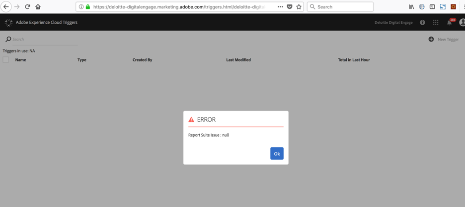
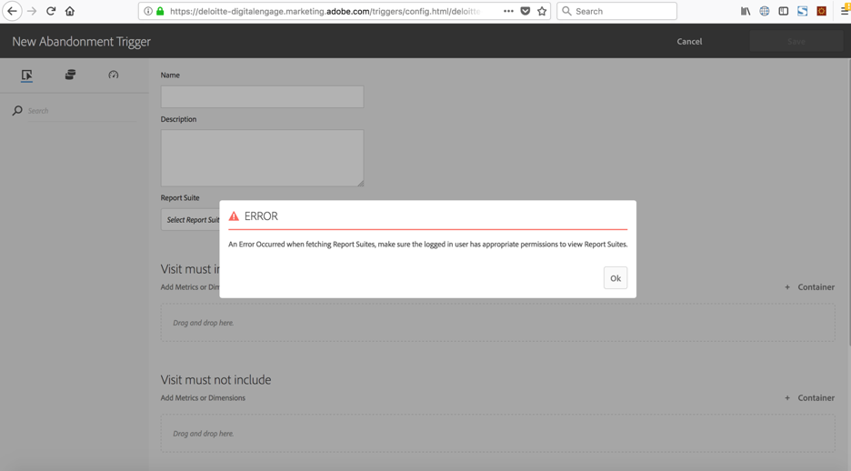

<!--:navorder: 3-->

# Adobe I/O Events Frequently Asked Questions (FAQ)

- [General questions](#general-questions)
    - [What are Adobe I/O Events?](#what-are-adobe-io-events)
    - [Which events are currently supported via I/O?](#which-events-are-currently-supported-via-io)
    - [What permissions are required to use I/O Events?](#what-permissions-are-required-to-use-io-events)
    - [Which subscription types do I/O Events support ?](#which-subscription-types-do-io-events-support)
    - [Are there other ways to access I/O Events?](#are-there-other-ways-to-access-io-events)    
    - [How far back are I/O Events available via the Journaling API?](#how-far-back-are-io-events-available-via-the-journaling-api)
    - [What happens if a webhook is down?](#what-happens-if-a-webhook-is-down)
    - [Do Adobe I/O Events notifications come from a range of static IPs?](#do-adobe-io-events-notifications-come-from-a-range-of-static-ips)
    - [What is the size of notifications when in batch delivery style?](#what-is-the-size-of-notifications-when-in-batch-delivery-style)
- [About JWT](#about-jwt)    
    - [What is JWT and what is it used for?](#what-is-jwt-and-what-is-it-used-for)
    - [Where can I find documentation on JWT Service accounts and how to set them up?](#where-can-i-find-documentation-on-json-web-token-jwt-service-accounts-and-how-to-set-them-up)
    - [Do you have sample libraries for JWT?](#do-you-have-sample-libraries-for-jwt)
    
* [Analytics Triggers Events](#analytics-triggers-events)
    - [Where can I find instructions on setting up Analytics Triggers for I/O?](#where-can-i-find-instructions-on-setting-up-analytics-triggers-for-io)
    - [Where do I configure Analytics Triggers for I/O?](#where-do-i-configure-analytics-triggers-for-io)
    - [What does an Analytics Triggers payload look like?](#what-does-an-analytics-triggers-payload-look-like)

## General questions

#### What are Adobe I/O Events?

Adobe I/O Events make meaningful Adobe Cloud Platform events available to 1st and 3rd party developers.

#### Which events are currently supported via I/O?

We are adding new events providers regularly,
at the time of writing, the following Adobe solutions are supported via I/O Events:

* [Creative Cloud Assets](https://www.adobe.com/go/devs_events_cc_docs) (deprecated) 
* Creative Cloud Libraries (replacing the above)
* Imaging API
* Adobe XD

* Adobe Document Cloud

* [Platform notifications](https://www.adobe.com/go/devs_events_aep_docs)
* [Analytics Triggers](https://www.adobe.com/go/devs_events_triggers_docs)
* [Marketo User Audit Data Stream](../using/marketo-user-audit-data-stream-setup.md)
* [Privacy Service](https://www.adobe.com/go/devs_events_privacy_docs) 
* [Cloud Manager](https://www.adobe.com/go/devs_events_cloudmanager_docs) 
* Asset Compute
* [AEM authors](../using/aem-event-setup.md) 
* Adobe Campaign Standard  

You can also register [your own Custom I/O Events Provider](../using/custom_events.md)


#### What permissions are required to use I/O Events?  

The various required permissions and entitlements vary according to the events provider,
(see the list above) some are opened to all Adobe customers, others to enterprise developers or administrators only.
Some of these events providers will required licensing other will be available to all.

#### Which subscription types do I/O Events support?  

I/O Events supports [webhooks](../intro/webhooks_intro.md) for near-real time notifications (push) 
as well as [a Journaling API](../intro/journaling_intro.md) (pull) to grab groups of events at a time.

#### Are there other ways to access I/O Events?

Yes: 
- [Azuqua](https://www.azuqua.com) provides connectors for both AEM events and Analytics Triggers events.
- [Microsoft Flow](https://flow.microsoft.com) has a connector for Creative Cloud Asset events.

#### How far back are I/O Events available via the Journaling API?

Adobe I/O stores 7 days of subscribed events that can be retrieved via the Journaling API.

#### What happens if a webhook is down? 

If Adobe I/O Events fails to receive a successful response code from your webhook within 10 seconds, 
it retries the request, including a special header: `x-adobe-retry-count`.
Adobe I/O Events will retry up to five times using an exponential backoff strategy
(it will retry up to (1 + 2 + 4 + 8 + 16 =) 31 minutes). 
After that time, if your webhook is still failing (with either no response or a response other than HTTP 2XX.), 
Adobe I/O Events will mark it as invalid and stops sending requests.

Note you can then use the Journaling API to retrieve events that were published while your webhook was down.

#### Do Adobe I/O Events notifications come from a range of static IPs? 

We had a few customers asking this in the context of securing their endpoint; 
their requirement: accepting traffic only from a range of static IPs.

The answer is no. Adobe I/O Events notifications services are hosted on AWS and Azure,
their IPs change over time.

Reminder: every Adobe I/O Events POST request 
holds an  [`x-adobe-signature`](../intro/webhooks_intro.md#authenticating-events) header, 
which allows you to verify that the request was really made by Adobe I/O Events;
however this is a non-negotiable requirement, you may choose to use the pull model instead, 
and leverage our [Journaling API](../intro/journaling_intro.md).          

#### What is the size of notifications when in batch delivery style?
     
When registering a webhook to receive Adobe I/O Events notifications, you can select the delivery style:
* either receiving one event at a time ("Single"): each event resulting in an HTTP request to the webhook URL
* or multiple events together ("Batch"): in this case, HTTP requests will still remain near-real time,  
the batch size will vary according to the load of events in the associated queue 
and the batch size will be at max 2MB bytes and will contain a maximum of 100 events.
     
## About JWT

#### What is JWT and what is it used for? 

JSON Web Token (JWT) is an open standard (RFC 7519) that defines a compact and self-contained way for securely transmitting information between parties as a JSON object. For more information on JSON Web Tokens, see [Introduction to JSON Web Tokens](https://jwt.io/introduction/) on JWT.io.

To use Adobe I/O Events, you&rsquo;ll need a set of client credentials to authenticate the identity of the caller and authorize access. The type of application you are building determines the type of integration that provides the client credentials you will need.

A Service Account integration allows your application to call Adobe services on behalf of the application itself, or on behalf of an enterprise organization.

For this type of integration, you&rsquo;ll need to create a JSON Web Token (JWT) that encapsulates your credentials and begin each API session by exchanging the JWT for an access token. The JWT encodes all of the identity and security information required to obtain an access token,  and must be signed with the private key that is associated with a public key certificate specified on your integration.

#### Where can I find documentation on JSON Web Token (JWT) Service accounts and how to set them up? 

See the Authentication Guide: [Creating a JSON Web Token](https://www.adobe.io/apis/cloudplatform/console/authentication/createjwt.html).

#### Do you have sample libraries for JWT? 

Yes:
- Python: https://pyjwt.readthedocs.io/en/latest/
- .Net: https://github.com/jwt-dotnet/jwt
- Java: https://github.com/jwtk/jjwt
- Objective C: https://github.com/yourkarma/JWT
- Node.js: https://github.com/auth0/node-jsonwebtoken
- Node.js: https://www.npmjs.com/package/jsonwebtoken
- Node.js: https://www.npmjs.com/package/jwt-simple
- JavaScript tutorial: - https://www.jonathan-petitcolas.com/2014/11/27/creating-json-web-token-in-javascript.html
- Javascript: http://kjur.github.io/jsrsasign/

## Analytics Triggers Events

#### Where can I find instructions on setting up Analytics Triggers for I/O?

You'll find it in this guide at [Integrate Analytics Triggers with Adobe I/O Events](../using/analytics-triggers-event-setup.md). 

#### Where do I configure Analytics Triggers for I/O? 

Analytics Triggers are set up and managed via the Experience Cloud Activation UI. Once a Trigger has been created, it will appear in Adobe I/O Console under the available I/O Events list.

#### What does an Analytics Triggers payload look like?

Here is a sample:

```json
{
  "event_id": "52ebf673-8aeb-4347-8852-bf86a18292e4",
  "event": {
    "envelopeType": "DATA",
    "partition": 13,
    "offset": 438465548,
    "createTime": 1516324157242,
    "topic": "triggers",
    "com.adobe.mcloud.pipeline.pipelineMessage": {
      "header": {
        "messageType": "TRIGGER",
        "source": "triggers",
        "sentTime": 1516324157228,
        "imsOrg": "C74F69D7594880280A495D09@AdobeOrg",
        "properties": [
          {
            "name": "trace",
            "value": "false"
          },
          {
            "name": "sourceFirstTimestamp",
            "value": "1516324106"
          },
          {
            "name": "sourceLastTimestamp",
            "value": "1516324128"
          },
          {
            "name": "triggerFiredTimestamp",
            "value": "1516324153995"
          }
        ],
        "messageId": "1a69fc40-7600-4928-b7bb-d66588a045f3"
      },
      "com.adobe.mcloud.protocol.trigger": {
        "triggerId": "697514a8-3337-4efc-ba75-1f0ba896c288",
        "triggerTimestamp": 1516324157228,
        "mcId": "00000000000000000000000000000000000000",
        "enrichments": {
          "analyticsHitSummary": {
            "dimensions": {
              "eVar3": {
                "type": "string",
                "data": [
                  "localhost:4502/content/we-retail.html",
                  "localhost:4502/content/we-retail/us/en/men.html",
                  "localhost:4502/content/we-retail.html",
                  "localhost:4502/content/we-retail/us/en.html",
                  "localhost:4502/content/we-retail/us/en.html",
                  "localhost:4502/content/we-retail/us/en/products/men/shirts/eton-short-sleeve-shirt.html",
                  "localhost:4502/content/we-retail/us/en/products/men/shirts/eton-short-sleeve-shirt.html",
                  "localhost:4502/content/we-retail/us/en/men.html",
                  "localhost:4502/content/we-retail/us/en/user/cart.html"
                ],
                "name": "eVar3",
                "source": "session summary"
              },
              "pageURL": {
                "type": "string",
                "data": [
                  "http://localhost:4502/content/we-retail.html",
                  "",
                  "",
                  "http://localhost:4502/content/we-retail/us/en.html",
                  "",
                  "",
                  "http://localhost:4502/content/we-retail/us/en/products/men/shirts/eton-short-sleeve-shirt.html",
                  "http://localhost:4502/content/we-retail/us/en/men.html",
                  "http://localhost:4502/content/we-retail/us/en/user/cart.html"
                ],
                "name": "pageURL",
                "source": "session summary"
              }
            },
            "products": {}
          }
        },
        "triggerPath": [
          {
            "timestamp": 1516324118010,
            "stateId": "start_and_and",
            "transition": "null"
          },
          {
            "timestamp": 1516324148711,
            "stateId": "vmi_and_1",
            "transition": "conditional -> select * where evars.evars.eVar3 like 'localhost:4502/content/we-retail/us/en/user/cart.html'"
          },
          {
            "timestamp": 1516324148711,
            "stateId": "notify_wait",
            "transition": "states visited -> [StateVisitedNode [stateId=vmi_and_1, count=1, operator=GE]]"
          },
          {
            "timestamp": 1516324153994,
            "stateId": "notify",
            "transition": "inactive_timeout -> 5"
          }
        ]
      }
    }
  }
```
  
**I receive errors trying to access Triggers.**  

The company/org is entitled for Analytics Triggers but I receive the following errors when trying to set up a Trigger:





**To fix:**  Ensure that Triggers is enabled in the Analytics Product Profile in the Admin Console. 


