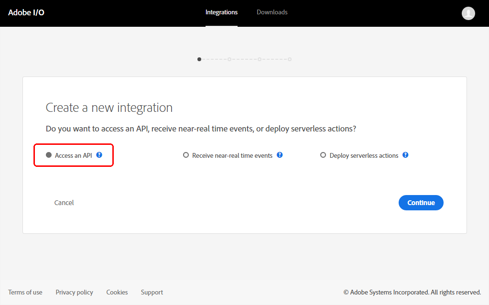
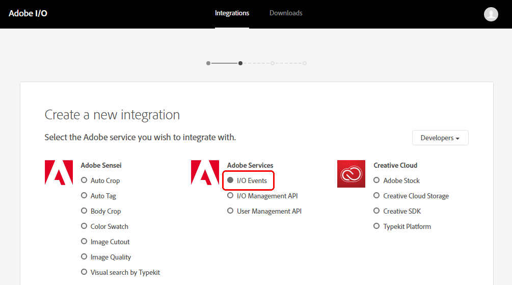
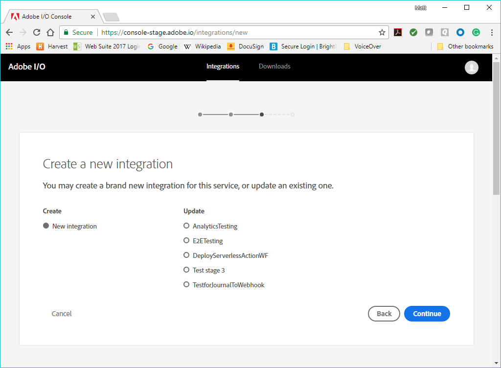
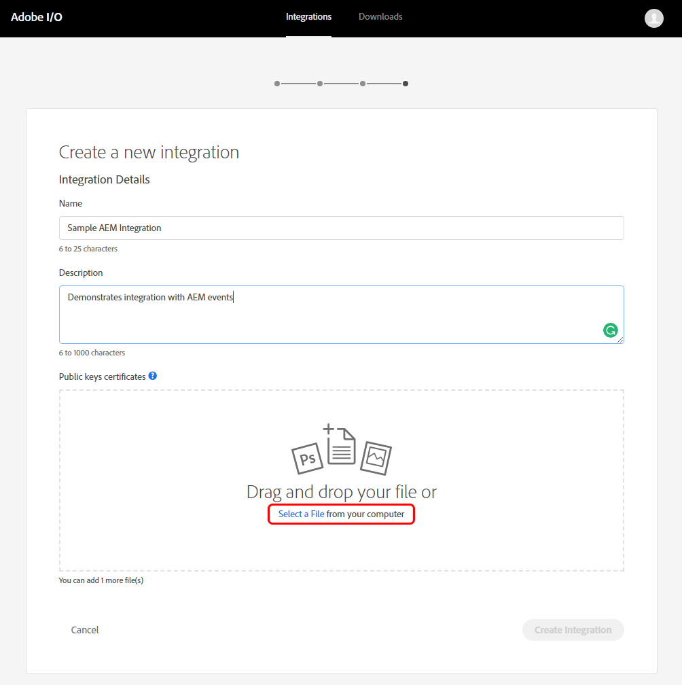

<!--:navorder:1-->

# Setting up AEM Events with Adobe I/O Events

These instructions describe how to set up Adobe Experience Manager (AEM) for Adobe I/O Events. You can use Adobe I/O for notification of AEM events, such as page or asset changes.

- [Introduction](#introduction)
- [Setup Products](#setup-products)
- [Use Adobe I/O](#use-adobe-io)
- [Watch the solution work](#watch-the-solution-work)

**Resources**
- [Debugging](../support/debug.md)
- [FAQ](../support/faq.md)
<!-- - [Debugging](../support/debug.md#aemevents) This will work eventually, check DEVEP bugs-->
<!-- - [FAQ](../support/faq.md#aemevents) This will work eventually, check DEVEP bugs -->

## Introduction

Before setting up and using AEM with Adobe I/O, you will need to do the following:

1. [Obtain authorization](#obtain-authorization)
2. [Register an AEM event consumer app](#register-an-aem-event-consumer-app)

### Obtain authorization

To complete this solution, you will need authorization to use the following services:

*   An AEM instance, version 6.2.x, 6.3.x, 6.4.x or 6.5.x with administrative permissions. (**Note:** AEM screens in this topic are captured from version 6.3.)
*   [Adobe I/O Console](https://adobe.io/console) access, with administrative permissions for your enterprise organization.


### Register an AEM event consumer app

You will need to register an AEM event consumer app, such as a webhook, to see responses to AEM changes.
These instructions include steps for setting up a webhook that is able to accept
and reply to a [challenge HTTP request](../intro/webhook_docs_intro.md##the-challenge-request) parameter sent by Adobe I/O Events.
For more information on understanding and working with webhooks,
see the [Introduction to Adobe I/O Events Webhooks](../intro/webhook_docs_intro.md).

## Setup Products

TODO all links to :
* [Integrate with `AEM On Premise`](aem/aem_on_premise_install.md)
* [Integrate with `AEM As a Cloud Service` ](aem/aem_skyline_install.md)


## Use Adobe I/O

Use Adobe I/O to do the following:

1. [Create an Adobe I/O Console integration](#create-an-adobe-io-console-integration)
2. [Register the AEM event consumer app](#register-the-aem-event-consumer-app)

### Create an Adobe I/O Console integration

To create an [Adobe I/O Console](https://adobe.io/console) integration:

1. After signing in to the Adobe I/O Console, select **New Integration**.

2. Select **Access an API** and then select **Continue**.

      

3. On the **Create a new integration** page, select **Adobe I/O Events** and then select **Continue**.

      

4. Select **New integration**.

      

5. In the <strong id="Create-new-integration-box">Create a new integration</strong> dialog box, specify a name for the integration and add a description. To add **Public keys certificates**, select **Select a File** and navigate to your **certificate_pub.crt** to upload it.

      

6. Select **Create Integration.**


### Register the AEM event consumer app

To register an AEM event consumer app, you can set up a webhook. Your webhook should be able to accept and reply to a challenge HTTP request parameter sent by Adobe I/O CSM.

#### Setting up a webhook: example
To create a webhook at webtask.io, add the following code to make sure the Challenge is echoed back. This is needed for the verification by Adobe I/O CSM when you register the webhook URL later using the CSM API:

```js
var express = require('express');
var Webtask = require('webtask-tools');
var bodyParser = require('body-parser');
var app = express();

app.use(bodyParser.json());
app.get('/webhook', function (req, res) {
   var result = "No challenge";
   if (req.query["challenge"]){
      result = req.query["challenge"]
      console.log("got challenge: " + req.query["challenge"]);
   } else {
      console.log("no challenge")
   }
   res.status(200).send(result)
});

app.post('/webhook', function (req, res) {
   console.log(req.body)
   res.writeHead(200, { 'Content-Type': 'application/text' });
   res.end("pong");
});

module.exports = Webtask.fromExpress(app);
```

## Watch the solution work

You can watch the solution work by testing your integration. To do this:

1. [Register your webhook with the Adobe I/O Console](#register-your-webhook-with-the-adobe-io-console)
2. [Perform a webhook health check](#perform-a-webhook-health-check)
3. [Optional: Adobe I/O Events OSGI to XDM event mapping configurations](#adobe-io-events-osgi-to-xdm-event-mapping-configurations)

### Register your webhook with the Adobe I/O Console

Once you have your webhook ready, use the [Adobe I/O Console](https://adobe.io/console) to register it:

1. On the Adobe I/O Console, select **New Integration**.

2. Select **Receive near-real time events** and then select **Continue**.

      

3. Select the AEM Link Externalizer base URL that you [previously specified](#configure-the-aem-link-externalizer) and then select **Continue**.

      

      >**Note:** If you do not see your instance, follow the below part: [Perform AEM health check](#perform-aem-health-check)

4. Select **Create new integration** and fill in the **Integration Details** form [similar to your previous integration](#create-an-adobe-io-console-integration).

5. Select **Add webhook** and complete the **Add a new webhook** form.

6. Select the events to which you want to subscribe and select **Save**.

      

