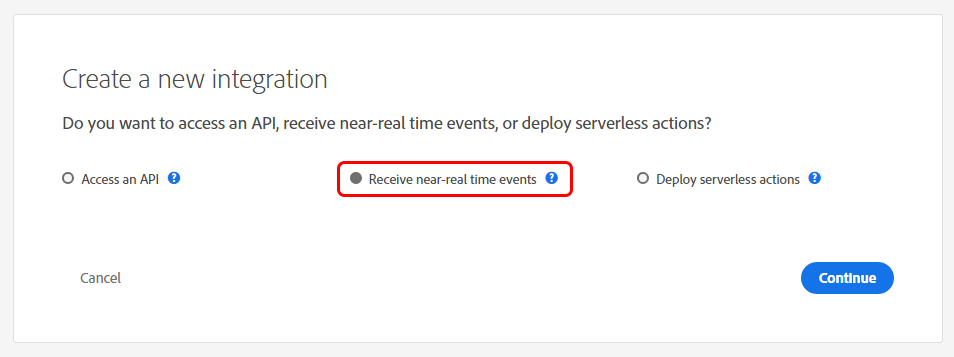
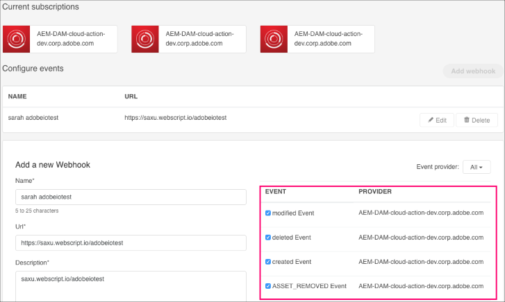

<!--:navorder:1-->

# Setting up AEM Events with Adobe I/O Events

These instructions describe how to set up Adobe Experience Manager (AEM) for Adobe I/O Events. You can use Adobe I/O for notification of AEM events, such as page or asset changes.

- [Introduction](#introduction)
- [Setup Products](#setup-products)
- [Use Adobe I/O](#use-adobe-io)

**Resources**
- [Debugging](../support/debug.md)
- [FAQ](../support/faq.md)
<!-- - [Debugging](../support/debug.md#aemevents) This will work eventually, check DEVEP bugs-->
<!-- - [FAQ](../support/faq.md#aemevents) This will work eventually, check DEVEP bugs -->

## Introduction

### Obtain authorization

To complete this solution, you will need authorization to use the following services:

*   An AEM instance, version 6.2.x, 6.3.x, 6.4.x or 6.5.x with administrative permissions. (**Note:** AEM screens in this topic are captured from version 6.3.)
*   [Adobe I/O Console](https://adobe.io/console) access, with administrative permissions for your enterprise organization.

## Setup Products

* [Integrate with `AEM On Premise`](aem/aem_on_premise_install.md) version 6.2.x, 6.3.x, 6.4.x or 6.5.x
* [Integrate with `AEM As a Cloud Service` ](aem/aem_skyline_install.md)

## Use Adobe I/O

### Have a webhook ready 
 
You will need to register an AEM event consumer app, such as a webhook, to see responses to AEM changes.
These instructions include steps for setting up a webhook that is able to accept
and reply to a [challenge HTTP request](../intro/webhook_docs_intro.md##the-challenge-request) parameter sent by Adobe I/O Events.
For more information on understanding and working with webhooks,
see the [Introduction to Adobe I/O Events Webhooks](../intro/webhook_docs_intro.md).

### Register your webhook with the Adobe I/O Console

Once you have your webhook ready, use the [Adobe I/O Console](https://adobe.io/console) to register it:

1. On the Adobe I/O Console, select **New Integration**.

2. Select **Receive near-real time events** and then select **Continue**.

      

3. Select your AEM host 
      

4. Select **Create new integration** and fill in the **Integration Details** form [similar to your previous integration](#create-an-adobe-io-console-integration).

5. Select **Add webhook** and complete the **Add a new webhook** form.

6. Select the events to which you want to subscribe and select **Save**.

      

