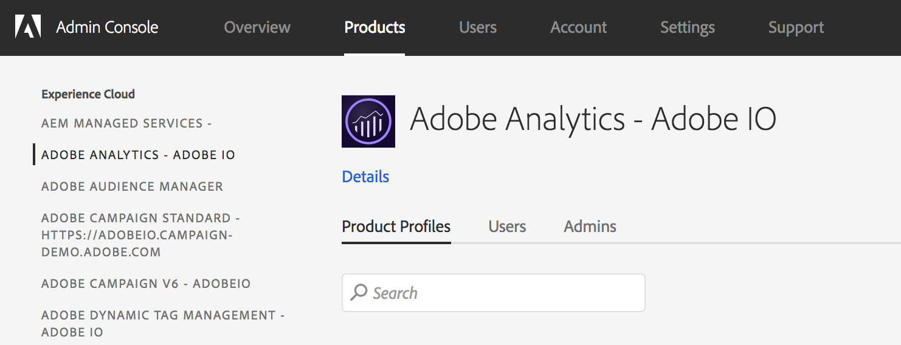
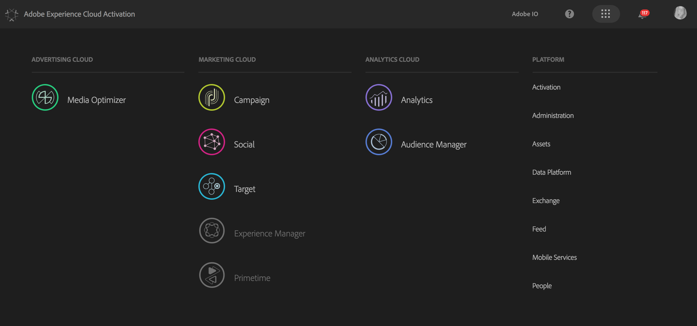
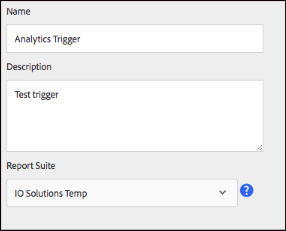
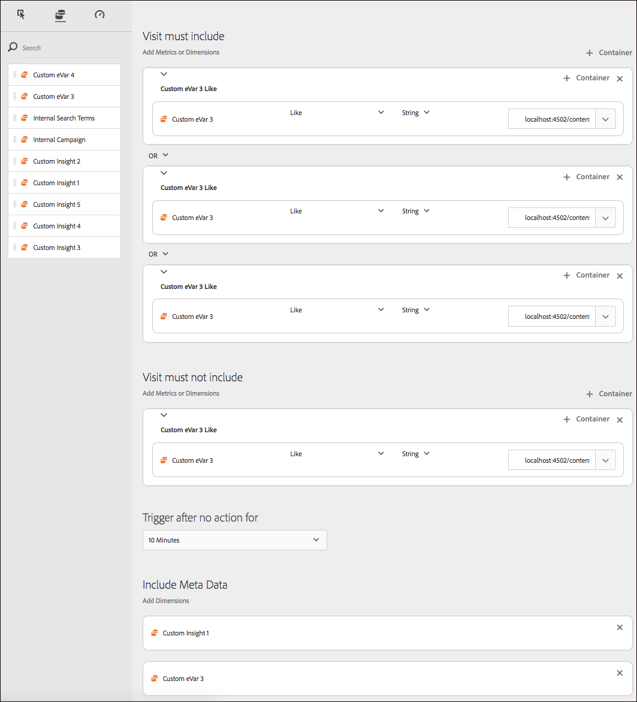
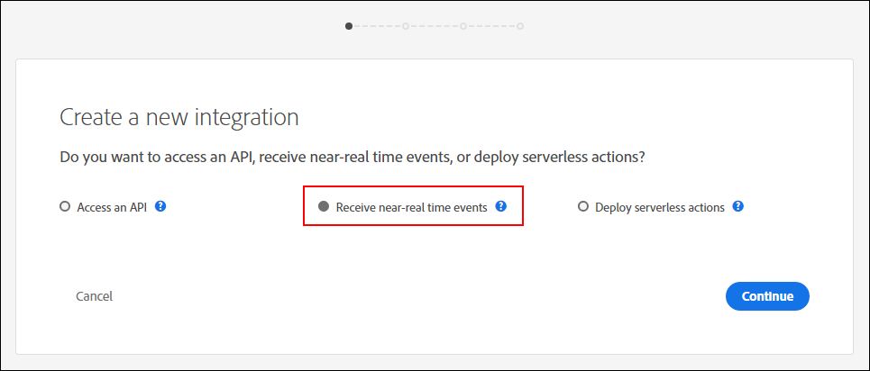
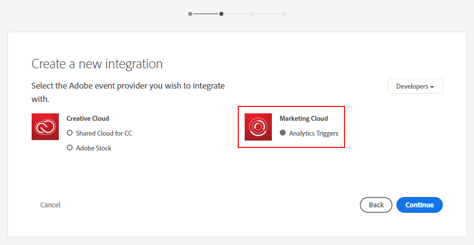
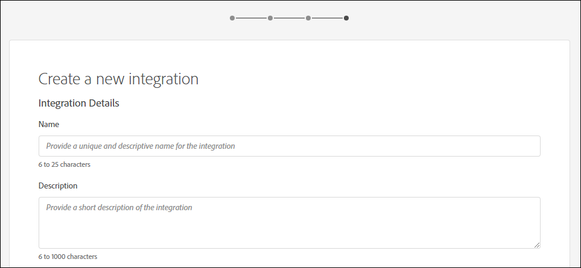
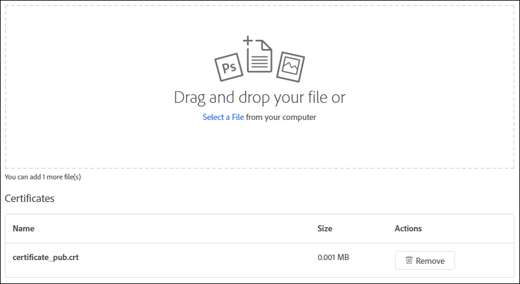
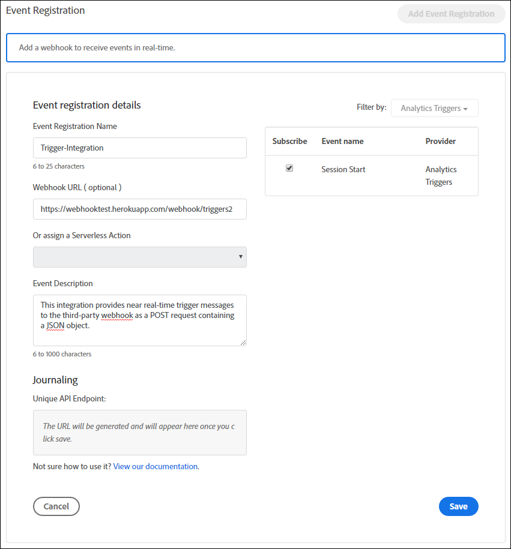
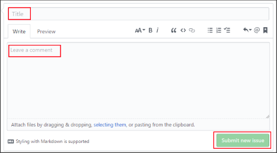

<!--:navorder: 2-->

# Integrate Analytics Triggers with Adobe I/O Events

These instructions describe how to use Adobe Analytics triggers to notify you of Adobe I/O events, including the behavior of your site&rsquo;s users. Follow the instructions below to try the solution yourself.

- [Introduction](#introduction)
- [Set up products](#setupproducts)
- [Use Adobe I/O](#useadobeio)
- [Watch the solution work](#watchthesolutionwork)

**Resources**
- [Debugging](../help/debug.md)
- [FAQ](../help/faq.md)
<!-- - [Debugging](../help/debug.md#analyticstriggersevents) This will work eventually, check DEVEP bugs-->
<!-- - [FAQ](../help/faq.md#analyticstriggersevents) This will work eventually, check DEVEP bugs -->

## Introduction

### What are Triggers?
Triggers is an Experience Cloud Activation core service that enables marketers to identify, define, and monitor key consumer behaviors, and then generate cross-solution communication to re-engage visitors. Triggers uses Adobe Analytics as the data source for consumer behavior.
For more information on triggers, see the [Triggers Help Page](https://marketing.adobe.com/resources/help/en_US/mcloud/triggers.html).

Before setting up and using Adobe I/O, you will need to do the following:

1. [Obtain product authorization](#obtainproductauthorization)
2. [Obtain administrative permissions](#obtainadministrativepermissions)

### Obtain product authorization

To complete this solution, you will need authorization to use the following services:
*   Adobe Analytics, including Triggers
*	Adobe Experience Cloud Activation Core Services
*   An [Adobe ID](https://helpx.adobe.com/x-productkb/global/adobe-id-account-change.html), if you do not have one already

### Obtain administrative permissions

You will also need administrative permissions for the following:
* Adobe Analytics
* Your enterprise organization

If you do not have administrative permissions, please contact your Adobe System Administrator. After requesting administrative permissions, watch for an email from Adobe Systems Incorporated, as shown:

   

### Set up products

To set up Analytics Triggers:

1. [Get product access through Adobe Admin Console](#getproductaccessthroughadobeadminconsole)
2. [Specify a new trigger](#specifyanewtrigger)

#### Get product access through Adobe Admin Console	 

To get access through the Adobe Admin Console:

1.	Sign into the console by clicking the **Sign in** button on the administrator rights email you received from Adobe and then providing your credentials.

2.	On the main screen of the Admin Console, select **Products**.

3.	On the Products page of the console, verify that your requested products have been added to the site and then select the **Adobe Analytics** icon.

      

4.	Select the **Details** links and do the following:

    1.	Verify that **Triggers** appears in the **Inclued Services** section.

        

  5. To give permissions to users who want access to Adobe services in the cloud:

     1. Select **User management** and then select **Users**.
     2. Select the user&rsquo;s name.
     
        

     3. For the user&rsquo;s **Access and rights**, provide **Product Access** and **Admin Rights** from the drop-down for the available products and services.
     
        

#### Specify a new trigger

You can specify triggers for many events on your site. This example will set notifications to be sent when carts are abandoned: set a trigger for sessions when the user visits either a **cart.html**, **checkout.html** or **order.html** page, but never reaches the **thank-you.html** page within a ten minute session. The trigger indicates that the user added products to the cart, and was about to make a purchase, but later decided otherwise, or forgot to complete the purchase.

To specify a new trigger:

1. On the Experience Cloud home page, select the **Apps** icon, and then select **Activation**.

    

2. In the **Web Activation** section, select the **Triggers** option.
    
    

3. On the **Triggers** page, select the **New Triggers** button, and then choose **Abandonment**.

    

4. On the **New Trigger** box, specify a **Name** and provide a **Description** for your trigger. Select the **Report Suite** that contains the Adobe Analytics data you want to trigger from.

    

5. On the **Triggers Settings** page, define the business rules for your trigger. You can drag a dimension/metric box from the left panel to the right side of the screen and then specify the business rules for what must happen and what must not happen in a session. In this case, set the trigger to fire after 10 minutes of inactivity after the rules are met.

    

6. Save your changes.

Once you save the trigger, any event in your report suite that meets the defined business rules criteria will cause a trigger to fire. You can view the status of triggers on the **Triggers** page.

## Use Adobe I/O

Use Adobe I/O to create a new integration with the Console. To do this:

1. After signing in to the [Adobe I/O Console](https://adobe.io/console), select **New Integration**.

    

2. Choose **Receive near real-time events** and continue.

    

3. Choose **Analytics Triggers** as an event provider and  continue.

    

4. Choose **Continue** again to move on to the next page without making any changes.

5. Provide the **Name** and **Description** for your integration.

    

6. Generate a public certificate. To do this:

    1. Open a terminal and execute the following command:

        `openssl req -x509 -sha256 -nodes -days 365 -newkey rsa:2048 -keyout private.key -out certificate_pub.crt`

    2. Upload the public certificate by selecting the **Select a File** link and then by uploading the certificate from your computer:

        

7. Add your event registration (webhook) details and save. For information on creating and registering webhooks, see [Introduction to Webhooks]../intro/webhook_docs_intro.md).

    

## Watch the solution work

Your enterprise may have its own tool that you can use to subscribe and listen to webhook events. Alternatively, you can use the following procedure to set up notifications with Slack.
To watch your trigger work on Slack:

1. Clone the repository and follow the setup described on https://github.com/hirenshah111/webhook_server.

2. Modify the Slack details in webhook_server/public/javascripts/app.js according to how you want to see the notifications.

3. Run the application and create a **triggers2** listener, then select **Connect**.

    

Trigger messages are received as `POST` requests on this thread.

## Authors
- Hiren Shah [@hirenoble](https://github.com/hirenoble).
- John Wight [@johnwight](https://github.com/johnwight).

## Feedback?

Please help make this solution as useful as possible. If you find a problem in the documentation or have a suggestion, select the **Issues** tab on this GiHhub repository, and then the **New issue** button. Provide a title and description for your comment and then select the **Submit new issue** button.

