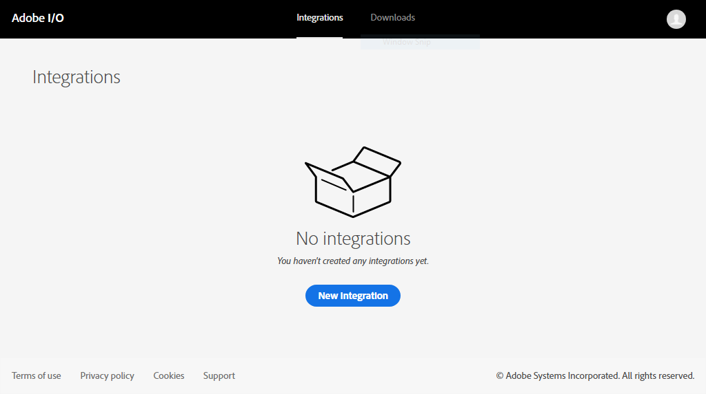
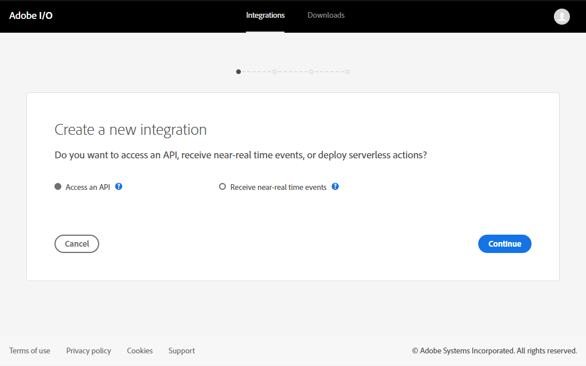
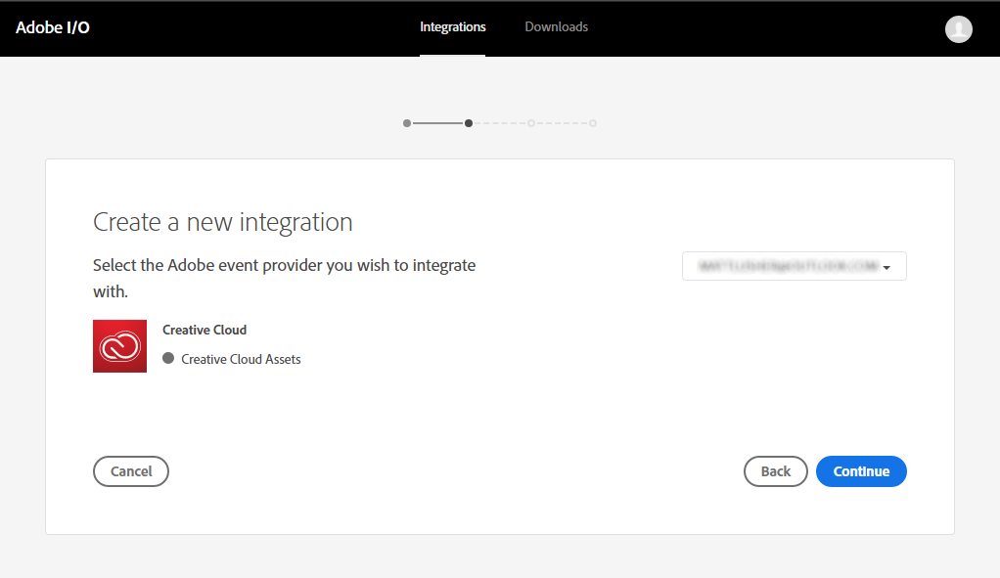
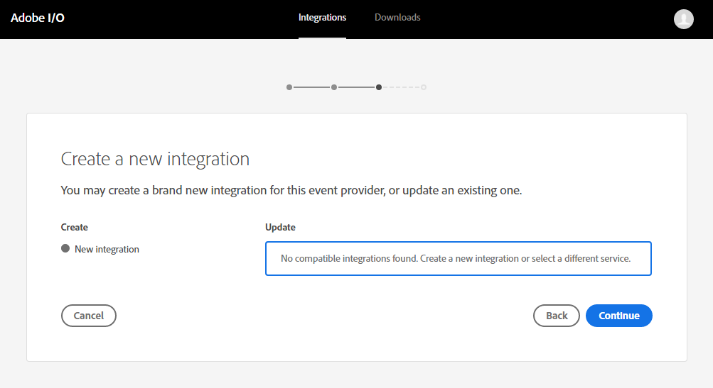
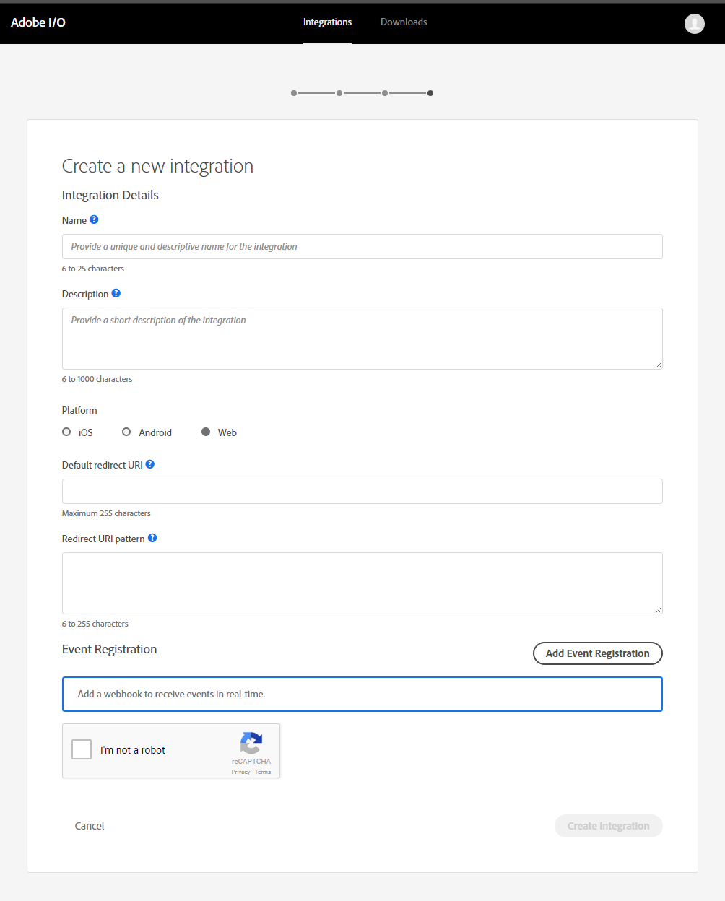
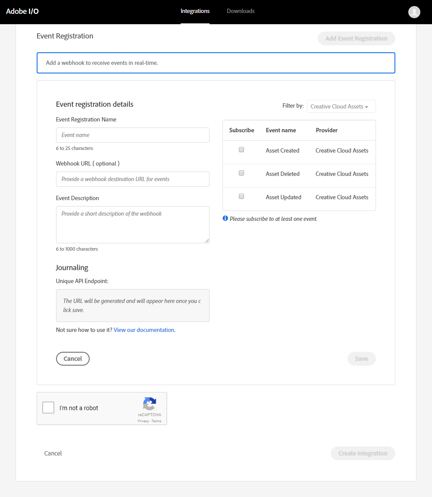
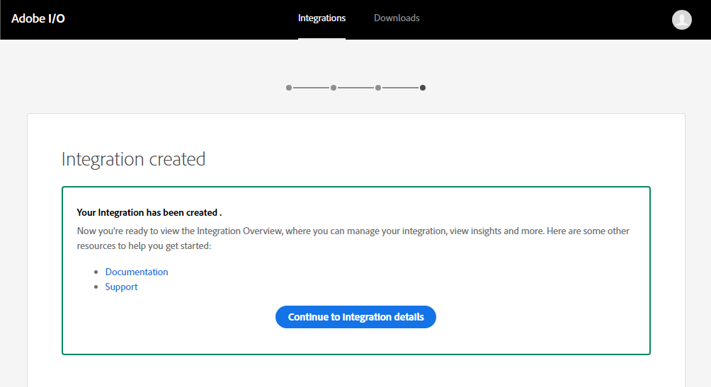
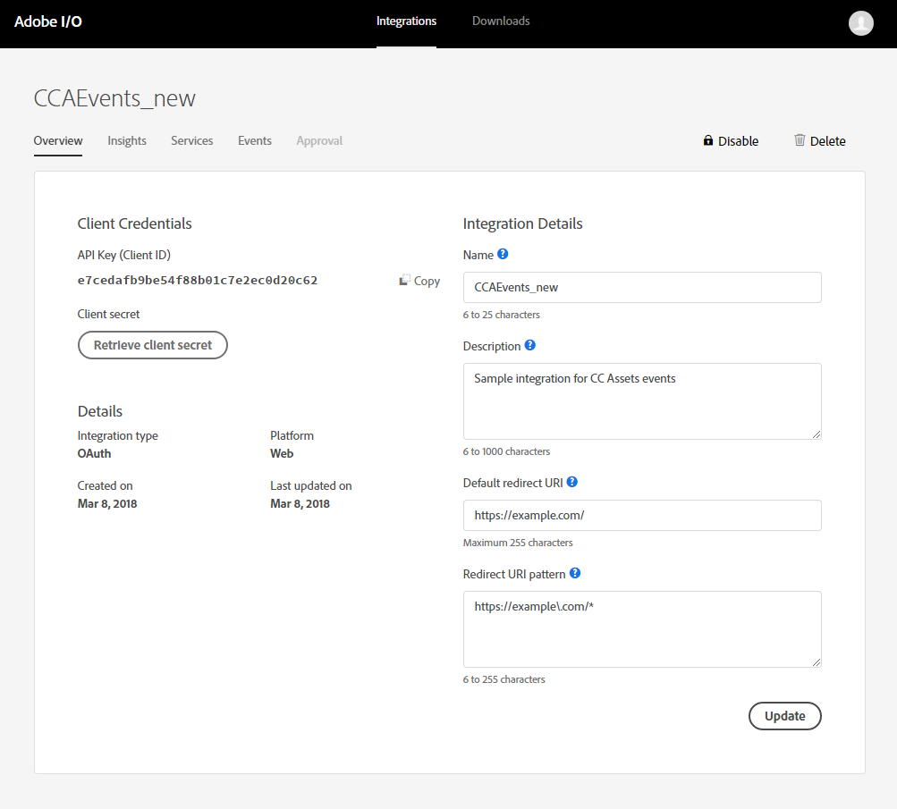
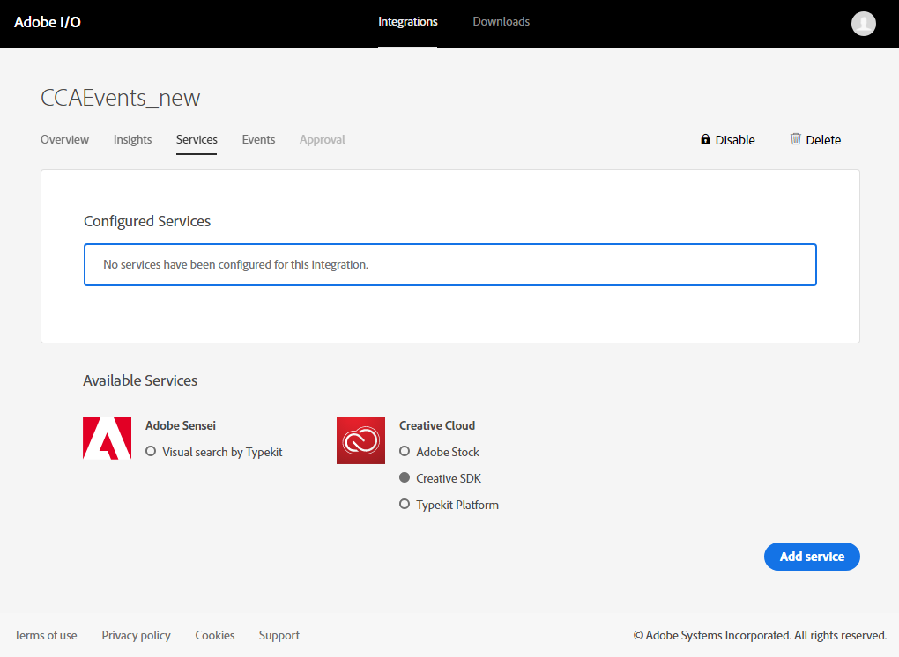

# Setting Up Creative Cloud Asset Events on Adobe I/O Events

These instructions describe how to set up Creative Cloud Asset events using Adobe I/O Events. You can use Adobe I/O for notification of CC Asset events. 

- [Introduction](#introduction)  
- [Access events](#accessevents)  
- [Create an integration](#createanintegration)  
- [Receive events](#receiveevents)
- [Adobe Consent API](#consentapi)

## Introduction
Creative Cloud Assets provides a simple set of events to which you can subscribe: 
- **asset-updated:** Triggers when an asset is changed or modified.
- **asset-created:** Triggers when a new asset is uploaded to Creative Cloud, or when an asset is _copied_ to a new folder (not when an asset is merely moved).
- **asset-deleted:** Triggers when an asset is _permanently_ deleted from Creative Cloud. Merely archiving an asset does not trigger the event. 
- **directory-created:** Triggers when a new folder is created in Creative Cloud.

There are no events for the following activities:
- Moving a file from one folder in Creative Cloud to another.
- Renaming a file. This is because assets are tracked in Creative Cloud by GUIDs, and the GUID doesn&rsquo;t change when the file is renamed. Creative Cloud recognizes that the asset hasn&rsquo;t changed, and can still find the asset by the same GUID. Any URL paths you create to that file, however, would change, since they do include the filename.

## Access events
Unlike other Cloud Platform event providers, Creative Cloud Assets does not require an enterprise account, or administrative status, to gain access for creating integrations or receiving events. However, the integrations you create will still need to authenticate the same way any other Adobe integrations do. Consider what kind of authentication your integration needs before you start, and follow the correct procedure (see [Adobe Authentication](https://www.adobe.io/apis/cloudplatform/console/authentication/gettingstarted.html)) to get the access rights your integration needs.


## Create an integration
For the purposes of this example, you&rsquo;ll be creating an individual integration using your personal Adobe ID. 

To create an integration for Creative Cloud Assets:

1. Log into [Adobe I/O Console](https://console.adobe.io). You&rsquo;ll see a list of any integrations you&rsquo;ve created so far. If this is your first, you&rsquo;ll see a button for creating an integration.

      

2. Select **New integration.** The &ldquo;Create a new integration" screen appears. 

    

3. Select **Receive near real-time events** and continue.

4. Select an event provider: Since you&rsquo;re using your personal account, the only provider you&rsquo;ll see is Creative Cloud Assets. Choose **Creative Cloud Assets** and continue.

    

5. You&rsquo;re offered one last chance to update an existing integration, if you have any; select **New integration** and continue.

    

6. Enter details for the integration. Console needs a name and a description; these can be whatever you want, subject only to length restrictions. Choose **Web** for the platform and provide a redirect URI and a redirect URI pattern.

    

>**Note:** Your integration needs to send a redirect URI to Adobe when it authenticates on behalf of a user, to send them to your integration once authentication is complete. The redirect URI you provide here is a default, to which Adobe I/O will fall back if the redirect URI in your authentication request fails. The redirect URI pattern is used by Adobe I/O to validate the redirect URI you provide with an authentication request. **All** redirect URIs must use HTTPS.

### Add a webhook
When you select &ldquo;Add Event Registration&rdquo;, the dialog expands to provide fields for you to define a webhook to receive Adobe Events. (For more on webhooks, see [Adobe I/O Events Webhooks](../intro/webhook_docs_intro.md).) The webhook you ultimately use should be part of the app you develop as your integration. For now, however, it&rsquo;s easy to set up a simple webhook to test your integration&rsquo;s connection with Adobe Events. 

Several tools exist on the web that can be used for this purpose: [ngrok](https://ngrok.com/), [Postman](https://www.getpostman.com/), and more. For this example, use ngrok. Ngrok is a utility for enabling secure introspectable tunnels to your localhost. With ngrok, you can securely expose a local web server to the internet and run your own personal web services from your own machine, safely encrypted behind your local NAT or firewall.

First, configure a local web server. There are a number of choices, depending on whether you're Windows, Mac, or Linux.
Next, you'll need a simple function to respond to the Adobe I/O challenge. Try this JavaScript:

```javascript
var express = require('express');
var Webtask = require('webtask-tools');
var bodyParser = require('body-parser');
var app = express();

app.use(bodyParser.json());
app.get('/webhook', function (req, res) {
var result = "No challenge";
if (req.query["challenge"]){
    result = req.query["challenge"]
    console.log("got challenge: " + req.query["challenge"]);
} else {
    console.log("no challenge")
}
res.status(200).send(result)
});

app.post('/webhook', function (req, res) { 
console.log(req.body)
res.writeHead(200, { 'Content-Type': 'application/text' });
res.end("pong");
});

module.exports = Webtask.fromExpress(app);
```

This simple webhook is designed merely to do what Adobe Events requires: handle an HTTPS GET request containing a `challenge` parameter by returning the value of the challenge parameter itself. 

Now you&rsquo;re ready to configure ngrok to serve your webhook over the internet:

1. Go to `https://ngrok.com/`. Download and install the application. Add the ngrok folder to your PATH, so you can invoke it from any command prompt.

2. Open a command-line window and type `ngrok http 80`; or whichever port you wish to monitor.

    

    In the ngrok UI, you can see the URL for viewing the ngrok logs, labeled "Web Interface", plus the public-facing URLs ngrok generates to forward HTTP and HTTPS traffic to your localhost. You can use either of those public-facing URLs to register your Webhook with Adobe I/O, so long as your application is configured to respond on your localhost accordingly. Once your testing phase is complete, you can replace the ngrok URL in your Adobe I/O integration with the public URL for your deployed app.

3. Now you&rsquo;re ready to complete the webhook registration process in Adobe I/O Console. Return to that window and enter the name, URL, and description for the webhook, pasting in the URL you got from ngrok with the path under localhost to your webhook file and the `/webhook` term added. Select all three events to receive: 
    - Creative Cloud Asset Created (`asset-created`) 
    - Creative Cloud Asset Updated (`asset-updated`)
    - Creative Cloud Asset Deleted (`asset-deleted`)

    

8. Save and complete the CAPTCHA. Select **Create  integration**. At this point, Adobe Events sends a test event to your webhook&rsquo;s destination URL. If your webhook responds correctly with the contents of the `challenge` parameter, your integration is successfully registered:

    

    Select **Continue to Integration details** to view and manage your integration.


## Receive events
 Your integration is now set up, and your webhook is in place; but to receive events, your integration needs to connect to its event provider, Creative Cloud Assets, on behalf of its user. This requires authentication; see [OAuth Integration](https://www.adobe.io/authentication/auth-methods.html#!AdobeDocs/adobeio-auth/master/AuthenticationOverview/OAuthIntegration.md). 
 
 Start with the Integration Overview. It&rsquo;s the screen you see immediately after selecting **Continue to Integration details**.



 For authentication setup, you&rsquo;ll need to add the [Creative SDK](https://www.adobe.io/apis/creativecloud/creativesdk/docs/websdk.html#!getting-started.md) as a service, and then use the [User Auth UI](https://www.adobe.io/apis/creativecloud/creativesdk/docs/websdk.html#!user-auth-ui.md) to build an interface for your user to log into your app and give your app authorization to access Creative Cloud Assets. 

 To add Creative SDK as a service:
 
 1. From the Integration Overview, select the Services tab:

    

 2. Under Creative Cloud, select **Creative SDK**, then select **Add service.** You&rsquo;re now ready to implement the User Auth UI.

 Adobe&rsquo;s User Auth UI lets you build into your application a login function that takes the user&rsquo;s Adobe ID and lets the user give your app permission to access the assets and Adobe Solutions to which they&rsquo;re subscribed. Once your app is authenticated, Adobe will begin to push events to your integration&rsquo;s webhook via HTTP POST messages.

## Adobe Consent API
To authenticate your app to receive your users&rsquo; events, you&rsquo;ll need to direct your users to the Adobe Consent API:

`https://ims-na1.adobelogin.com/ims/authorize/v1?response_type=code&client_id=`_`api_key_from_io_console`_`&scope=AdobeID%2Copenid%2Ccreative_sdk`

You will need to replace api_key_from_io_console with the value from your Adobe I/O Console overview tab API Key (Client ID), for this integration.

A good utility for testing this process is the [Adobe IMS OAuth Playground](https://runtime.adobe.io/api/v1/web/io-solutions/adobe-oauth-playground/oauth.html). Follow instructions in the FAQ.
