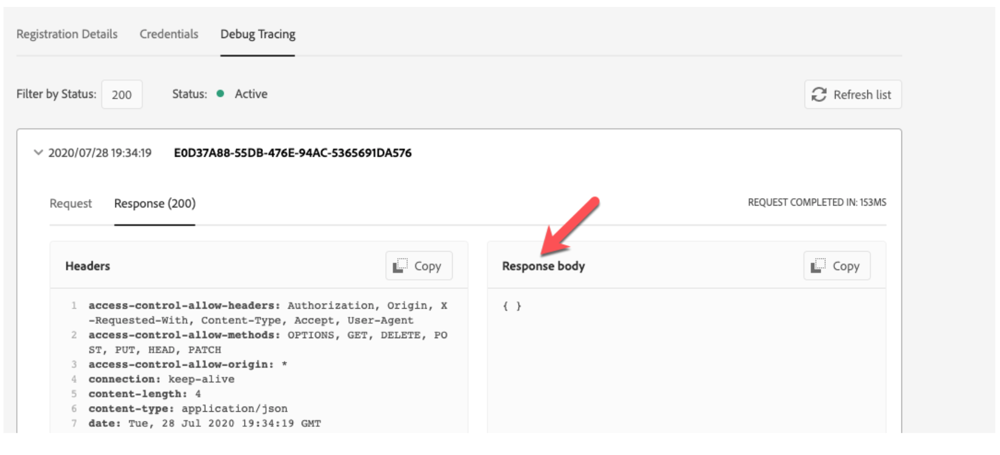
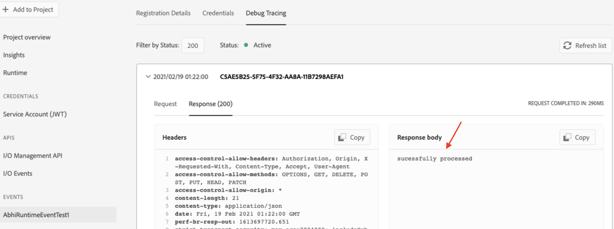
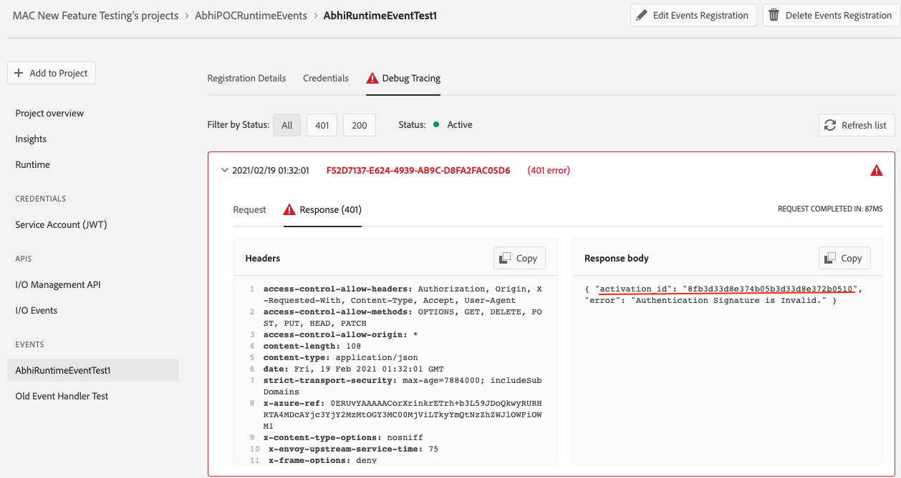
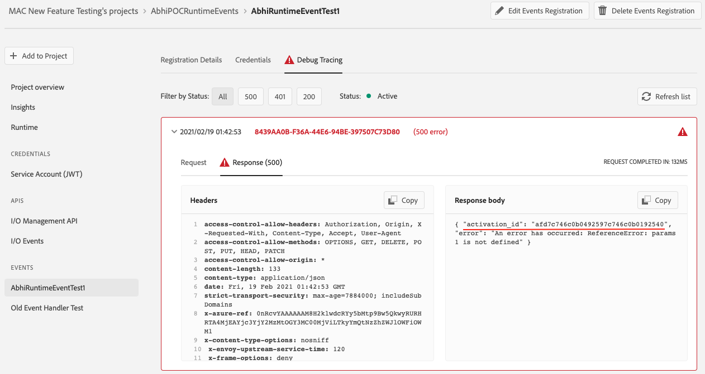
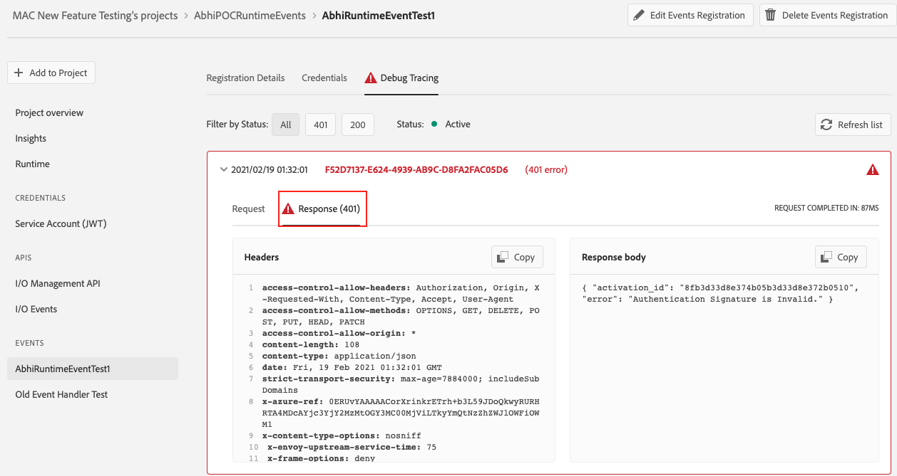
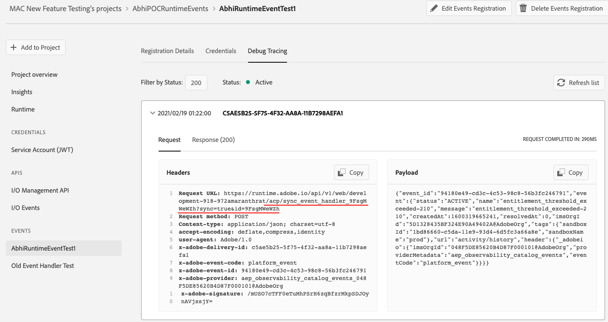

## Runtime Actions as Webhook

Adobe I/O Runtime lets you create actions and set them up as webhook to incorporate custom responses to events in your applications. You can either create synchronous actions and use them as events integration webhook or for long-running async actions you can use the [journaling approach](https://adobeio-codelabs-journaling-events-adobedocs.hlx.page/?src=/README.html) for consuming events.

## Setting up Webhook Integration with Runtime Action

The Runtime cli will let you create runtime action and hook them with an integration via developer console. Read [here](https://www.adobe.io/apis/experienceplatform/runtime/docs.html#!adobedocs/adobeio-runtime/master/getting-started/setup.md) to setup your cli with Runtime plugin which is required as pre-requisite.

- Go to Developer Console and start creating an event registration
- Add [Runtime](https://www.adobe.io/apis/experienceplatform/console/docs.html#!AdobeDocs/adobeio-console/master/services-enable-runtime.md) to your project, this will create the required auth and runtime namespace for you.
- Go to `aio-cli` and create and deploy your user-action in your namespace. 
- Come back to Developer Console and you will see deployed runtime action in your namespace under the `User Defined Actions` section once you refresh.
- Now set up an event registration using the runtime action you just deployed. You would need to select option 2 (Runtime Action) in your `Configure event registration` page. Choose your runtime action from the dropdown and click `Save configured events`
- This will create an event registration with an event handler webhook pointing to your runtime action. 

## Benefits and Improvements using Runtime Action as Webhook

If your use-case suits having a runtime action that responds within a short time frame, we recommend using the webhook (SYNC based) approach to get the below mentioned benefits.

- [Built In Signature Verification](#built-in-signature-verification)
- Improved Debugging 
    - [Debug tracing shows your action response](#debug-tracing-shows-your-action-response)
    - [Debug tracing shows activation ids for failed invocations](#debug-tracing-shows-activation-ids-for-failed-invocations)
- [No more duplicate action invocations](#avoiding-duplicate-action-invocations)

### Built In Signature Verification

From the security standpoint of webhook invocation, until now there was no way to verify that the event invocation requests to your publicly exposed runtime webhooks are coming from I/O Events and not any malicious user. But, now your runtime webhooks are made secure by being provided with an OOTB signature verification implementation that's working under the hood. So, basically whatever runtime action you use to create an event registration the webhook created due to that will place a signature validator action along with your action as in a [sequence](#https://github.com/AdobeDocs/adobeio-runtime/blob/master/reference/sequences_compositions.md). I/O Events signs the event payload with client's secret signature and pass them in request header to webhook. Whatever requests will come to your webhook will only invoke your business logic runtime action when the validator action successfully verifies that the correct signature has been passed to invoke your webhook.

### Debug Tracing Shows Your Action Response

Debug tracing is a pretty important tool on Developer Console for users who want to be informed whether their webhook invocation is successful or not or what it responds. However, there was a gap in this feature wherein users could not know if their action has succeeded or what the action actually returned, until now. Users could only see an empty response body (as shown below) in the `Debug Tracing` response which was not a good user experience.  

Now, after setting up a runtime action as webhook, user can see custom response returned from their own runtime action for success and failure scenario respectively in the `Debug Tracing` webhook response section as below. 

### Debug Tracing Shows Activation Ids for Failed Invocations

This is another major debugging issue users had to face due to missing activation ids for the activation that ran their runtime action. Until now

 - User sought information on what failed in their action code by using the `x-openwhisk-activation-id` returned in the webhook response header.
 - This activation id, however, is of the main event handler of the webhook invocation and not the user action code itself.
 - User has no way to map their runtime action failure to an activation id that is known upfront to him in debug tracing.
 - Even if the user action was failing behind the scenes, there was no way he could know about it as there was empty response from the webhook invocation with no valid activation id.

This is not the case anymore and you can now see this feature improved as below 

 - In case of any failed invocation, you would get an error response body with activation id for the same. 
 - This activation id you can use in the cli to trace the actual error occurred in your invocation by doing `aio rt activation logs <failed_activation_id>`
 - You may now get activation ids for two types of failed activations - 
   - Signature Validator Action 
   - Your Runtime Action  
 - In case of failure in the signature verification step, this is how you will get the error response and the failed activation id for the same.

    

 - For failed invocation to your runtime action, you will get an error response with the failed activation id for the same like below

    

 - You will also note that valid error response codes now comes in webhook response based on what's happening with your action invocation.

    

    
### Avoiding Duplicate Action Invocations

On developer console, when users create an event registration and hook their runtime action to it, it creates an event handler webhook. Under the hood, this handler webhook is tied to your runtime action based on [trigger and rules](#https://github.com/AdobeDocs/adobeio-runtime/blob/master/reference/triggersrules.md) using the `provider_id` and `event_code` selected in your event registration. This setup, however lead to the below situation 
   - for multiple event registrations in the same integration, each pointing to a different user action, user used to see the same `acp/event_handler` as the only handler webhook.
   - when user creates two different registrations using the same provider_id and event_code that created same trigger for both of them.
   - that caused each of those registrations bound to two different actions.
   - So, essentially what user had was this
      -  Reg 1 → Trigger 1 → Rule 1 → Action 1
      -  Reg 2 → Trigger 1 → Rule 2 → Action 2
   - when a webhook call happens for one registration it internally makes invocations to both the user actions based on the same trigger registered for them. 
   - user used to see 2 different activations in the cli for a single webhook call.

The above problems are now taken care of and you would now see that 
   - unique handler webhook is getting created for each of your event registrations in the same integration.
   
   - this unique event handler binds each of your event registrations in the same integration to a single action that you selected while setting up the registration.
   - it is now made sure that a webhook call to your unique handler inokes a single activation to the action bound to that handler.
   - this way you are now having 1:1 mapping between each registration (webhook url) and user action to be invoked.

